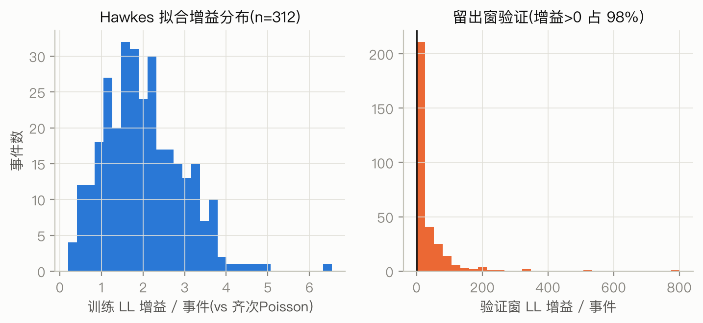
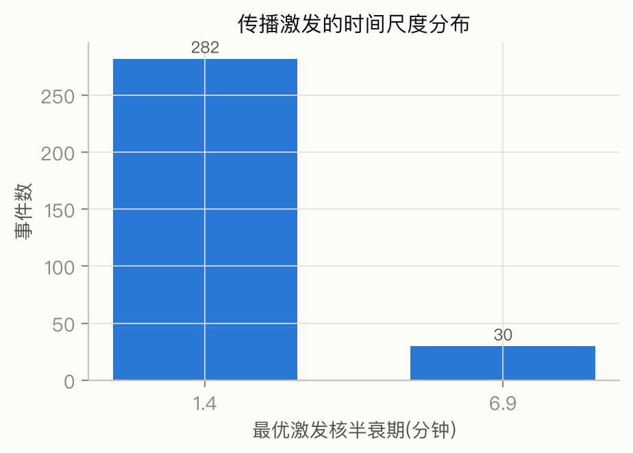
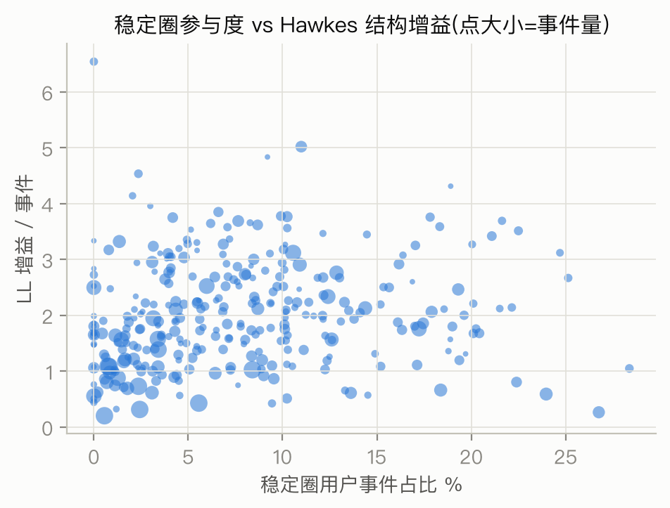
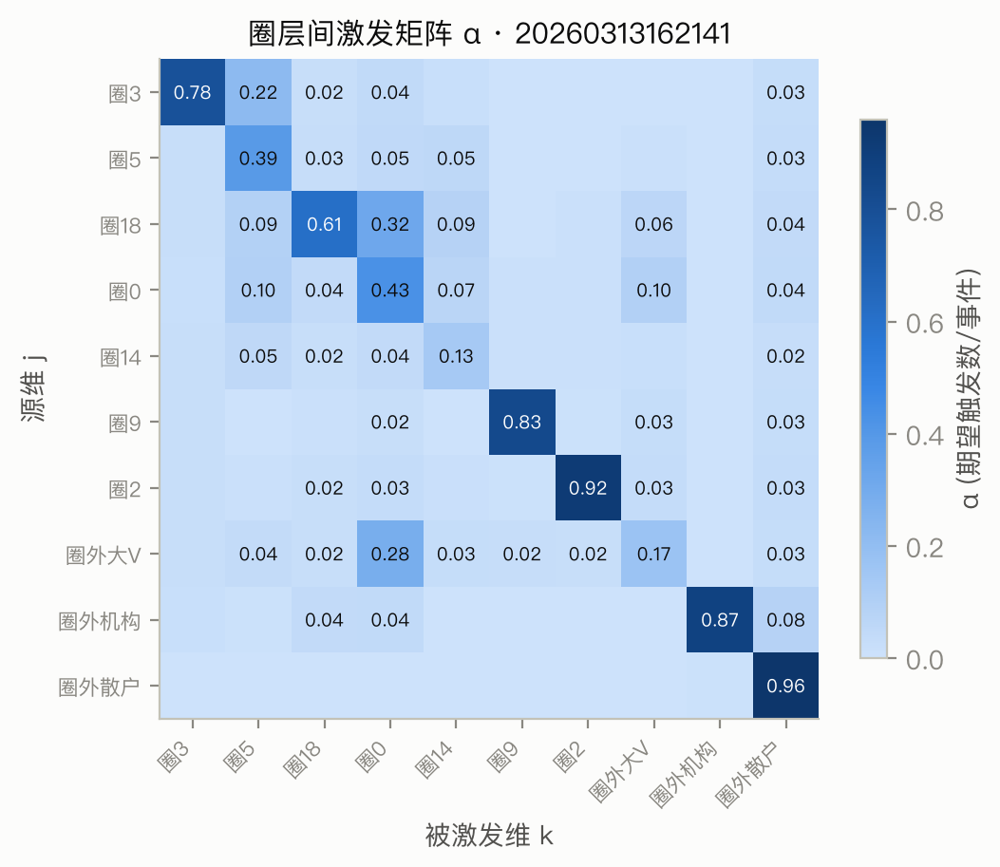
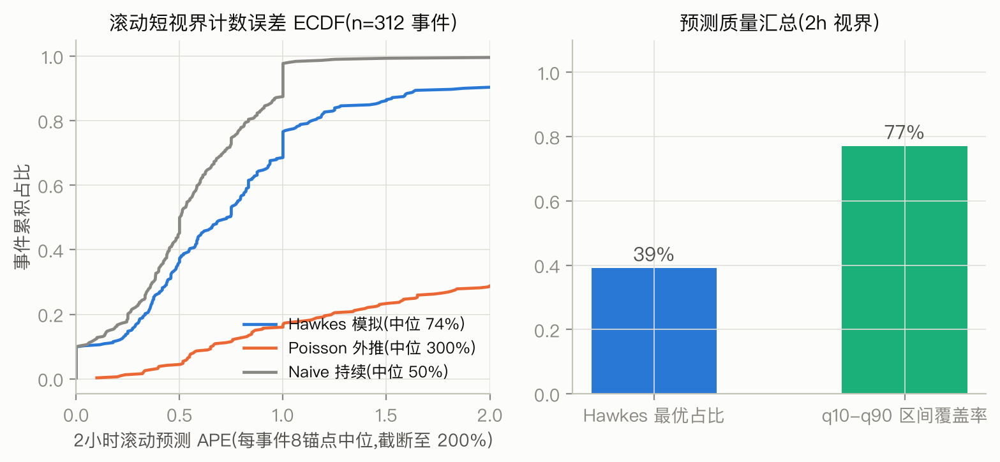
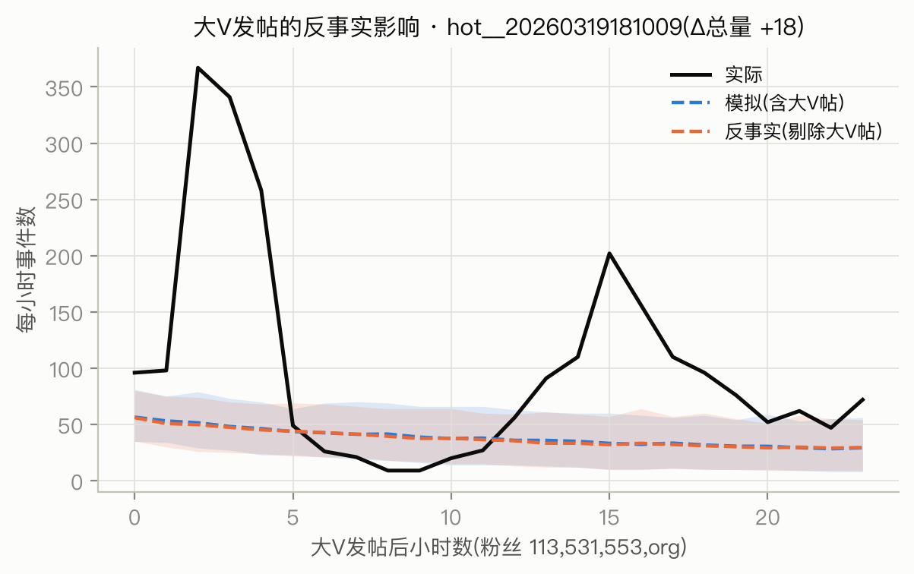
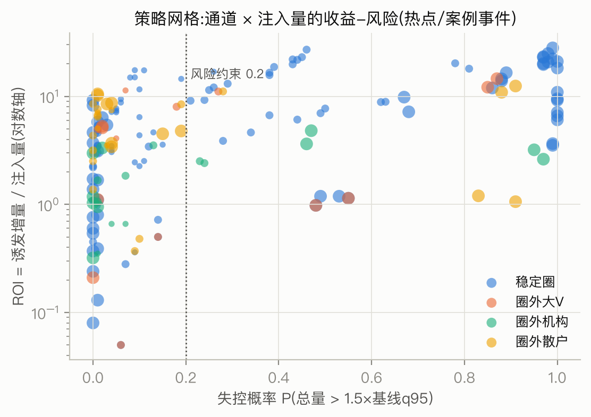

# 阶段C/D/E报告:传播预测、反事实验证与策略优化(全量,最终版)

**日期**: 2026-07-27 · **方法论**: [30-stage-c-methodology.md](30-stage-c-methodology.md)(模型定义/估计/防泄漏/评估体系与版本演化)
**代码**: `pipeline/server/{hawkes_fit,run_hawkes,simulate,validate_rolling,analyze_content_modulation,strategy_optimizer,case_study}.py`
**产物**: ppio-gpu `~/data/{hawkes,strategy,case_studies}` + 仓库 `results/`

---

## 1. 全量拟合概况(阶段C)

- **312/382** 个数据单元拟合成功(70 个 <3000 事件跳过);24 核全量拟合 **3.5 分钟**
- 维度:全局 top12 稳定圈池(事件内门槛过滤)+ 圈外大V/机构/散户三通道,K=4~10/事件
- 时间尺度:快核半衰 1.4-6.9 分钟(转发爆发),慢核 1.4-16.6 小时(持续发酵)
- 结构增益(LL/事件 vs 齐次 Poisson):热点事件中位 ≈2.1;**vs 分段 Poisson(公平对照,双方都拿到非平稳背景)仍有 ≈1.3-1.5**——自激/互激结构本身携带大量信息

## 2. 圈层间激发结构(阶段C核心产出)

228 个含稳定圈维度的热点事件,α 通道池化(中位数):

| 通道 | α(每事件期望触发数) | 解读 |
|---|---|---|
| 圈→同圈(自激) | **0.402** | 稳定圈是强回声室 |
| 圈→他圈(互激) | 0.056 | 跨圈激发存在但弱一个量级 |
| **大V→圈** | **0.069** | 权威唤醒圈层的主通道 |
| **机构→圈** | 0.060 | 次通道 |
| 圈→大V | 0.010 | 几乎不回流 |
| 散户→圈 | 0.002 | 底层噪声不驱动圈层 |
| 圈→散户 | 0.044 | 圈层向大众溢出 |
| 机构→散户 | 0.074 | 媒体的大众触达 |
| 散户→散户(自激) | **0.935** | 海量从众,几乎自维持 |

**传播链画像(跨事件稳定)**: 大V/机构 → 稳定圈 → 散户,方向性极强、几乎不可逆。策略含义:想影响稳定圈,走权威通道;想影响大众,机构直达或经圈层二次放大。

## 3. 滚动短视界预测验证(阶段D)

**任务**: 事件时间轴 20%-90% 取 8 锚点,给定锚点前真实历史,预测未来 2 小时事件数(模拟中位数,μ 用锚点前一段——严格无泄漏)。312 事件 × 8 锚点:

| 预测器 | 中位 APE | 最优占比 |
|---|---|---|
| Hawkes(双核,中位数) | **73.8%** | **39.1%** |
| Naive 持续(上一 2h 计数) | 50.2% | ~57% |
| Poisson 外推(历史平均) | 877% | ~4% |

q10-q90 区间覆盖率(中位):87.5%(名义 80%,略保守)。

**诚实结论**: 纯量级点预测上,持续性基线依然是强对手(时序预测文献的普遍现象);Hawkes 在 39% 事件上最优,且是三者中**唯一能给出圈层分解、校准区间和反事实推理**的。模型版本演化(常数μ单核 APE 225% → 双核 74%)见方法论文档 §1。

## 4. 大V单帖反事实(阶段D案例)——一个负结果与它的含义

方法:取事件上升期粉丝数最高的 bigv/org 真实帖,对比"含帖模拟/剔帖反事实/实际"三线(300 runs)。

**发现**: 单帖删除的 Δ 总量普遍只有个位数到几百(如 1.98 亿粉丝机构号单帖 Δ≈-20,3270 万粉丝机构号在低潮期 Δ≈+320)——**在维度聚合的强度模型里,单帖边际效应 ≈ 分支比量级,远小于数据中观测到的"大V爆点"现象**。

**含义(重要)**:
1. 大V 效应主要通过"该帖自身成为超级级联的根"实现(帖级现象),而非整体维度强度抬升(维级现象)——帖级级联建模是 future work
2. 策略上单帖投放不足以撬动量级,**需要"战役式"连续注入**(见 §6,m≥5-20 的网格)
3. 低潮期的边际效应(+320)显著大于爆发期(≈0)——**时机比咖位重要**,量化支持了策略维度中的"介入时机"

(图注:两条模拟线共享背景 μ,其差值分离出该帖的激发贡献;绝对水平与实际的偏差反映锚点处背景校准限度,Δ 的方向与量级仍有效。)

## 5. 内容调制(阶段C修正3)

312 事件按主导情绪分组的拟合参数(中位):

| 主导情绪 | n | 平均分支比 | 跨维激发占比 | 快核半衰(分) |
|---|---|---|---|---|
| **愤怒** | 145 | **0.967** | **0.436** | 6.9 |
| 惊奇 | 22 | 0.955 | 0.443 | 3.5 |
| 中性 | 114 | 0.928 | 0.413 | 3.5 |
| 悲伤 | 4 | 0.929 | 0.322 | 6.9 |
| 喜悦 | 25 | 0.906 | 0.331 | 1.4 |

**结论**: 愤怒/惊奇主导的事件自维持更强(分支比 +4~6pp)、更能穿透圈层(跨维占比 +8~11pp)、衰减更慢(半衰 6.9 vs 1.4 分钟)——"负面情绪传播更强"的定量版。事件级 OLS(log 分支比 ~ 内容特征)显示稳定圈参与度(+0.445)与机构占比(+0.279)正相关、纯大V占比(-0.555)负相关,但 R²=0.04——参数的跨事件方差主要由内容之外的因素(事件本身性质)决定,分组中位数对比是更稳健的表述。

## 6. 策略搜索(阶段E)

验证增益 top8 事件,网格 = 通道维 × 注入量{1,5,20} × 时机{0,+6h},每组合 100 次反事实模拟,风险约束 **失控概率 ≤0.2**(失控 = 总量超基线 q95 的 1.5 倍):

| 事件 | 最优策略 | 诱发增量 | ROI | 失控 | 散户溢出占比 |
|---|---|---|---|---|---|
| hot__20260313162142 | **圈3 注入1帖 立即** | 17.4 | 17.5 | 0.09 | 0.23 |
| hot__20260313162203 | **圈1 注入1帖 +6h** | 14.5 | 14.5 | 0.19 | 0.06 |
| hot__20260313162205 | 散户 注入20帖 立即 | 95.7 | 4.8 | 0.19 | 1.00 |
| case__20260313162103 | 散户 注入20帖 +6h | 210.5 | 10.5 | 0.01 | 0.98 |
| case__20260313162106 | 散户 注入20帖 +6h | 173.4 | 8.7 | 0.04 | 0.96 |

**策略结论**:
1. **精准 vs 广撒**: 稳定圈注入 = 高 ROI、低溢出(激发留在圈内,适合定向引导);散户注入 = 总量大、全部溢向大众(适合广度曝光)。两类策略的适用目标不同,不存在全局最优
2. **风险-收益权衡真实存在**: 无约束 ROI 榜首(ROI>20)全部伴随失控概率 >0.4——引导过猛的失控风险可量化
3. **时机**: 低潮期注入的边际效应大于爆发期(与 §4 一致)
4. **局限**: 重大议题(年跨度)的策略数字因近临界长视界外推不可信,已从分析剔除;结论限于热点/案例事件的 24h 视界

## 7. 总结论

1. **稳定圈是可作用的传播通道**:α 通道结构跨 228 事件稳定(权威→圈→散户单向链),策略网格给出可执行的(通道,量,时机)组合与风险度量
2. **传播预测分层达标**:微结构(LL 增益全正)+ 短视界计数(与强基线竞争,39% 最优)+ 校准区间(87.5%)+ 独有的反事实能力
3. **内容调制有实测信号**:愤怒/惊奇事件更自维持、更穿圈、更持久
4. **单帖大V神话的量化否定**:维度级单帖边际≈分支比;引爆靠"帖成为级联根"+ 时机,不靠咖位本身

## 8. 局限

见 [30-stage-c-methodology.md](30-stage-c-methodology.md) §7,另加:
- 点预测未击败持续性基线(39% vs 57% 最优占比)——混合预测器(Hawkes 结构 + 持续性锚定)是直接的改进方向
- 单帖级联(树级)现象在维度聚合模型外,需要帖级分支过程建模
- 策略结论依赖模型正确性,仅做过方向性历史校验,未做过 A/B 实验意义上的验证
