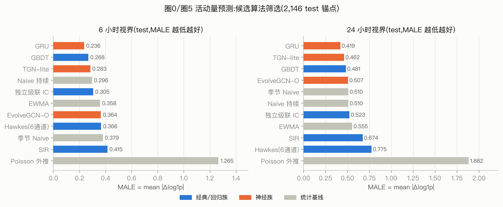
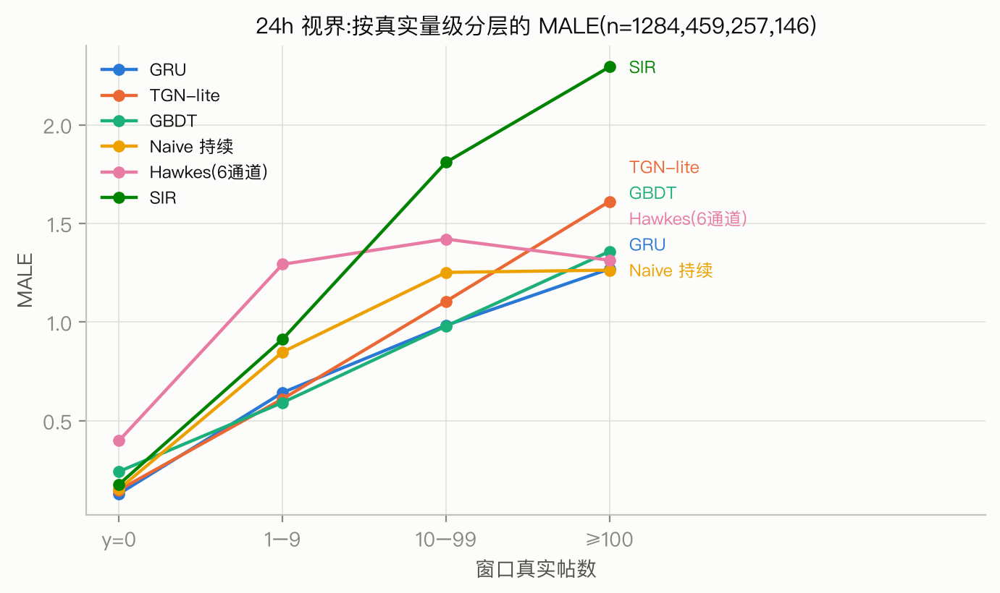
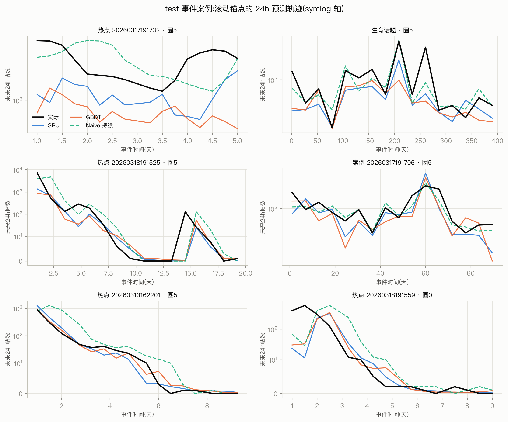
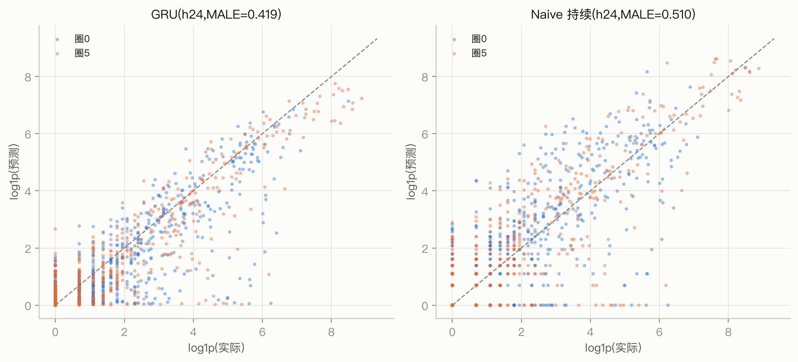

# 传播预测算法筛选实验:圈 0 与圈 5(2026-07-29)

**目标**: 为"圈层活动量预测"选定进入大规模验证的算法——**回归族一个、神经族一个**。
**对象**: 圈 0(高产政务转发层,5,678 人)与圈 5(大 V 枢纽,8,924 人)——阶段 A 稳定圈中
信息流量最大与话语权密度最高的两个圈。
**代码**: `experiments/pred_screen/`(独立小实验目录,服务器 `~/circleiq/pred_screen/`)。
**结论先行**: 神经族选 **GRU 多通道序列回归**,回归族选 **GBDT 特征回归**;两者在双视界上
都显著优于 naive 持续基线,而全部机制模型(Hawkes/SIR/IC)在圈层粒度点预测上**没有打过 naive**。

---

## 1. 任务定义与协议

给定事件 e 在锚点 t 前的全部真实历史,预测圈 c∈{0,5} 成员在 (t, t+H] 内该事件中的发帖量
(原创+转发,md5_mid 去重)。

| 项 | 设定 | 依据 |
|---|---|---|
| 视界 H | **6h / 24h 双视界** | 预扫描:圈粒度 2h 窗中位计数=0(阶段 D 的 2h 口径在圈粒度不可用),24h 窗非零率 33% |
| 锚点 | 事件窗内每 6h,最少 24h 历史,近 7 天全通道有帖(活动门,仅看历史) | 覆盖上升/峰值/衰减/休眠全相位 |
| 切分 | **按事件** 60/10/30 train/val/test(md5 哈希确定性交错) | 模型不得见 test 事件任何数据,杜绝事件内泄漏 |
| 锚点上限 | train 64 / val 16 / test 16 每事件(均匀抽样) | 防长事件(生育话题 1400 锚点)统治面板 |
| 配对门槛 | 该圈在该事件总帖数 ≥100 | 低于此无学习/评估价值 |
| 主指标 | **MALE** = mean \|log1p(ŷ)−log1p(y)\|(重尾计数标准做法) | 辅助:RMSLE、中位 APE(分母 max(1,y),对齐阶段 D 口径)、AUC(y>0 判别)、配对胜率 |

**面板规模**: 269 事件有效,471 个(事件,圈)配对,20,592 锚点(train 17,630 / val 816 / test 2,146)。
test 的 y24 分布:60% 为 0,非零部分 p50=5、p90≈112、max 7,184——**零膨胀+重尾**是本任务的
基本形态,也是后面所有结论的背景。

通道定义(六通道,数据集与所有模型共用):c0、c5、其他稳定圈、圈外大V、圈外机构、散户。

## 2. 候选算法

**统计基线**: naive 持续(上一等长窗计数)、季节 naive(24h 前同窗)、EWMA(半衰 12h)、
Poisson 外推(全历史均速)。

**经典/回归族**:
- **SIR**(滑窗 ODE 网格拟合,R0×γ×有效人口 120 组合/锚点)
- **独立级联 IC**(圈内稳定图 906 万边裁剪出的圈内子图上蒙特卡洛,种子=近期活跃成员,
  激活概率边权归一×p_scale,p_scale 在 val 上校准)
- **Hawkes 六通道**(锚点前 14 天窗重拟合双时间尺度核+分段 μ——复用已验证的 v3 拟合器,
  但维度换成本实验六通道;前向模拟取中位数)
- **GBDT**(HistGradientBoosting,38 维特征:目标圈 1h–168h 多尺度窗、六通道 6/24/72h、
  趋势比、日周期/星期、事件年龄、活跃成员数、圈指示;log1p 目标)

**神经族**:
- **GRU 多通道序列**(168h×8 通道序列输入,64 隐层,双头输出 log1p y6/y24;19K 参数)
- **TGN-lite**(自实现记忆式时间图网络:14,606 节点=两圈全员+4 聚合节点,转发交互流驱动
  GRUCell 记忆更新 + Time2Vec,圈池化读出;48K 参数)
- **EvolveGCN-O**(自实现:6h 快照×28 步回看,GRU 演化两层 GCN 权重,圈池化读出;6.4M 参数)

未纳入:DeepHawkes/CasFlow 等帖级级联模型(预测对象是单帖级联规模,与圈层活动量任务不对齐,
且帖级建模已列为 future work)。

## 3. 主结果(test,2,146 锚点,全模型同键集)

### 6h 视界

| 模型 | MALE↓ | RMSLE | 中位APE | AUC | 胜过naive |
|---|---|---|---|---|---|
| **GRU** | **0.236** | 0.495 | 0.045 | 0.952 | 23.5% |
| **GBDT** | **0.268** | 0.539 | 0.072 | 0.935 | 22.6% |
| TGN-lite | 0.283 | 0.598 | 0.028 | 0.933 | 21.2% |
| naive | 0.296 | 0.641 | 0.000 | 0.861 | — |
| IC | 0.305 | 0.673 | 0.000 | 0.896 | 16.0% |
| EWMA | 0.358 | 0.691 | 0.047 | 0.944 | 18.2% |
| EvolveGCN-O | 0.364 | 0.793 | 0.009 | 0.946 | 17.3% |
| Hawkes(6通道) | 0.366 | 0.742 | 0.000 | 0.889 | 13.1% |
| 季节naive | 0.379 | 0.830 | 0.000 | 0.864 | 13.9% |
| SIR | 0.415 | 0.861 | 0.026 | 0.881 | 16.9% |
| Poisson | 1.265 | 1.669 | 1.570 | 0.802 | 11.7% |

### 24h 视界

| 模型 | MALE↓ | RMSLE | 中位APE | AUC | 胜过naive |
|---|---|---|---|---|---|
| **GRU** | **0.419** | 0.804 | 0.112 | 0.919 | 33.9% |
| TGN-lite | 0.462 | 0.862 | 0.190 | 0.918 | 31.9% |
| **GBDT** | **0.481** | 0.826 | 0.304 | 0.907 | 32.1% |
| EvolveGCN-O | 0.507 | 0.932 | 0.141 | 0.912 | 30.3% |
| naive / 季节naive | 0.510 | 0.959 | 0.000 | 0.868 | — |
| IC | 0.523 | 0.969 | 0.229 | 0.892 | 23.9% |
| EWMA | 0.555 | 0.979 | 0.212 | 0.908 | 26.5% |
| SIR | 0.674 | 1.213 | 0.196 | 0.845 | 22.9% |
| Hawkes(6通道) | 0.775 | 1.315 | 0.230 | 0.871 | 17.6% |
| Poisson | 1.882 | 2.346 | 4.400 | 0.760 | 12.9% |

(naive 的中位 APE=0 是零膨胀的产物:60% 锚点 y=0 且 naive 也报 0,平局不计入胜率——
胜率 34% 要在"60% 样本双方全对"的背景下读。)

### 显著性(按事件 bootstrap ×400,MALE 差,95% CI)

| 对比 | h6 | h24 |
|---|---|---|
| GRU − naive | **−0.060 [−0.083, −0.039]** ✓ | **−0.091 [−0.127, −0.058]** ✓ |
| GBDT − naive | **−0.028 [−0.051, −0.008]** ✓ | −0.029 [−0.069, +0.009](不显著) |
| GRU − GBDT | **−0.031 [−0.045, −0.020]** ✓ | **−0.062 [−0.081, −0.050]** ✓ |
| TGN − GRU | +0.046 [+0.021, +0.077](TGN 更差)✓ | +0.042 [+0.017, +0.075] ✓ |
| GRU+naive 混合 − GRU | +0.018(更差)✓ | +0.017(更差)✓ |

## 4. 分层与案例

按 24h 真实量级分层(n=1284/459/257/146):
- **y=0 层**(60%): GRU 0.130 最稳;Hawkes 0.399 最差——近临界分支比在休眠期仍持续
  产出正预测(系统性偏高,bias +0.42),这复现并放大了阶段 D 的"冷却期高估"问题
- **1–9 / 10–99 层**: GBDT/GRU/TGN 一档,领先 naive 0.2–0.3 个 MALE
- **≥100 层**(爆发): **naive 反而追平 GRU**(1.263 vs 1.269)——爆发相位持续性最强,
  学习模型在这里没有超额价值;SIR/EvolveGCN 在此层崩坏(2.1–2.3)
- 圈间:两圈排名一致(GRU 圈0 0.438 / 圈5 0.397),圈 5 略易预测(活动更集中于大事件)

案例图可见典型形态:衰减期各模型都贴住;再燃点(如 20260318191525 第 14 天)所有模型都
滞后一拍(naive 滞后最明显);GRU/GBDT 在峰值处系统性低估(log 目标的收缩效应),但量级
和相位跟得住。

## 5. 结构性结论(为什么是这两个)

1. **机制模型全线失利是结构性的,不是调参问题。**
   - Hawkes:短窗重拟合(每锚点 14 天)让 α/μ 方差大,近临界分支比把中位数模拟推高;
     它在阶段 C/D 的价值(通道分解、区间、反事实)不依赖点预测精度,定位不变,
     但**不应作为大规模点预测的引擎**
   - SIR:单峰假设,多峰/再燃事件(社媒常态)必然错;耗尽机制在"关注度"场景不成立
   - IC:无时间轴,"一轮级联收敛集合"与"24h 窗计数"对不齐;p_scale 校准也救不回
   - 共同点:它们把**机制先验**押在数据上;而本数据在圈层粒度的可预测信号主要就是
     **短期持续性+日周期+通道间相对强度**,这恰是特征回归和序列模型直接吃到的
2. **图结构在这个粒度没有增益。** TGN-lite(成员级交互流)和 EvolveGCN(快照图演化)都
   稳定劣于纯序列 GRU(Δ≈+0.04–0.05,显著)。圈内"谁转谁"的微观结构对**圈级总量**的
   边际信息,已被六通道计数序列基本覆盖;图模型的开销(TGN 208s、EvolveGCN 469s vs
   GRU 14s)换不来精度
3. **混合预测器假设被否定。** 阶段 CDE 提出的"Hawkes+持续性锚定"方向,在 log 空间
   GRU/GBDT+naive 等权混合上验证:混合**更差**(+0.017–0.018,显著)——GRU 已把持续性
   信息学进去了,再锚定只会稀释;该 future-work 方向可以关闭
4. **爆发层是共同短板。** ≥100 层所有模型 MALE≥1.19,无人明显赢过 naive。大规模验证
   阶段若要攻这一层,方向是帖级级联特征(超级传播帖识别)而非换模型

## 6. 选型与大规模验证建议

| 族 | 选定 | 理由 | 成本(本面板) |
|---|---|---|---|
| 回归 | **GBDT(HistGradientBoosting,38 特征)** | 非神经族最优;h6 显著胜 naive;训练 1s/视界、推理毫秒级;特征可解释(增益主要来自多尺度窗口+通道结构) | 训练 2s |
| 神经 | **GRU 多通道序列(19K 参数)** | 双视界全场最优、对 naive/GBDT/图模型全部显著;14s 训完,推理批量毫秒级;结构最简单,大规模跑最稳 | 训练 14s(4090) |

大规模验证注意:
- 双视界都保留;若加 2h 视界需先把目标聚合到多事件或全稳定圈(单圈 2h 太稀)
- 评估继续按事件 bootstrap;分层报告(y=0/低/中/爆发)比单一均值信息量大
- GBDT 作为"可解释对照",GRU 作为主预测器;两者残差相关性低的锚点(分歧样本)
  值得人工看——通常是再燃点
- Hawkes 保留在论文的机制解释/反事实章节,不进预测赛道

## 附:实验产物清单

| 产物 | 位置 |
|---|---|
| 数据面板 | 服务器 `~/circleiq/pred_screen/out/{events/*.npz, members.npz, anchors.parquet, panel.json}` |
| 各模型预测 | `out/preds/*.parquet`(11 模型统一 schema) |
| 结果汇总 | `out/screening_results.json`、`out/analysis.json`(仓库 `experiments/pred_screen/results/` 有副本) |
| 图 | `docs/figures/32-screen_{male,strata,cases,scatter}.png` |
| 代码 | `experiments/pred_screen/*.py`(common/build_dataset/baselines/fit_{sir,ic,hawkes6}/train_{gbdt,gru,tgn,evolvegcn}/evaluate/analyze_results/make_figs_screen) |
