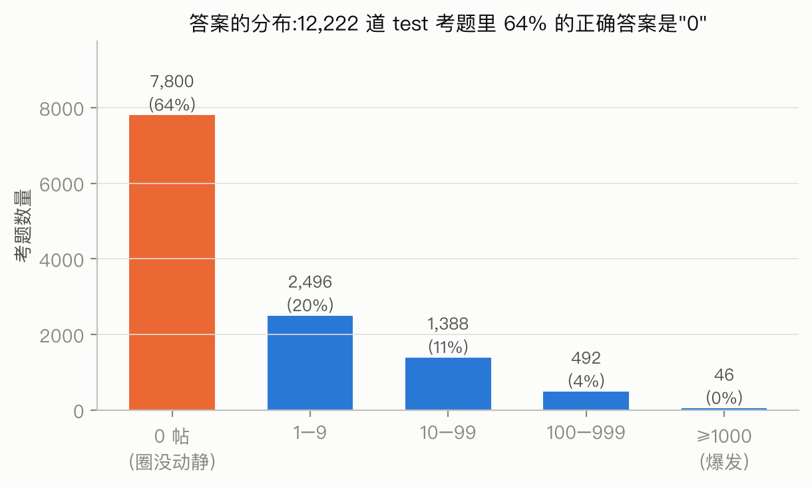
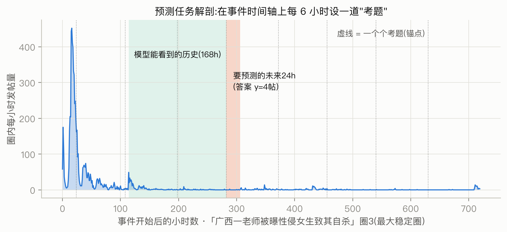
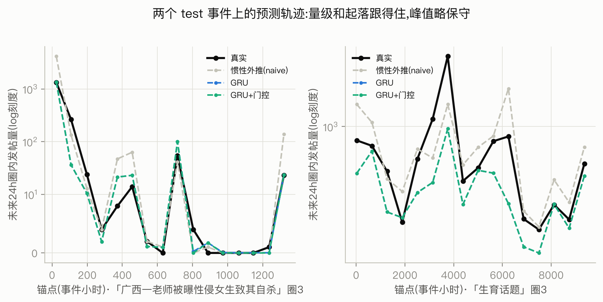

# 圈层活动量预测的大规模验证:方法、结果与解读

> 本文是 `33-prediction-fullscale-report.md`(技术版)的解读版。技术版为可复现性保留了
> 全部实现细节与参数;本文回答的是:这项实验**在解决什么问题、为什么这样设计、
> 结果应当怎么读、其中有什么值得注意的发现**。

## 摘要

**目的**:检验"提前 6/24 小时预测每个圈层在一个热点事件中的发帖量"这件事,在全部
66 个主要圈层、382 个事件的规模上是否真的可行——此前的结论只建立在 2 个圈的小实验上,
不足以支撑论文的核心主张。

**过程**:把全部数据组织成 10 万道"考题"(每道 = 给模型看某圈层过去 7 天的活动,
让它预测未来 6/24 小时),用统一的评分规则对比 12 种预测方法(4 种零学习基准 + 8 种学习方法及其变体);
另做一次"防作弊审计",排除圈层划分环节隐含的未来信息;最后针对数据最突出的特点
(测试集中 64% 的考题 24 小时答案是"零")做了六种改进尝试。

**结论**:①机器学习模型确实比"惯性外推"这一强基准更准,且优势在统计上可靠;
②表现最好的方案不是更大的模型,而是**把问题拆成两问**——先判断"圈会不会动"(是/否),
再预测"动多大"(数量),两问各用最擅长的工具;③爆发(单圈 24h 达到 100 帖以上)没有任何主线方法能赢过惯性外推,这是数据的性质
而非模型的缺陷,我们如实作为边界写入。

**结果**:主指标(量级误差,24h 视界,下同)从基准的 0.485 降到 0.390,相对改善 20%;
"圈会不会被激活"的判别能力 AUC 约 0.92(h24 0.917 / h6 0.936;AUC 以 0.5 为瞎猜、
1 为完美,且不受"多数答案是零"的基率抬高——全报"不动"并不能得高分);七类圈层中六类都显著受益,唯一例外(地域圈)本身几乎不参与
热点传播,这一"例外"反而是圈层特性的直接证据。

**意义**:预测层是整个"圈层特性 → 引导策略 → 效果预测"链条的中间件。本实验确立了
两件事:引导策略的**效果基线**可以被量化预测(误差已知、边界已知),而预测的失败区
(爆发)恰好圈定了后续风险管理必须依赖模拟而非预测的范围。

---

## 1. 研究问题:预测"圈层的下一步"为什么重要、为什么难

赛题要求"量化预测策略对圈层舆论及用户行为的影响效果"。任何"影响效果"都是一个差值:
**实施策略后的状态 − 不实施的状态**。后者就是预测问题——如果连"不干预时圈层接下来
24 小时会发多少帖"都估不准,那么任何"策略带来了多大改变"的说法都无从谈起。
所以预测层的角色是**效果评估的地基**,而非独立的炫技环节。

这个问题的难点不在模型,在数据的三个特性:

1. **大部分时间什么都不发生**。一个圈层在一个具体事件里,多数时段是安静的——
   我们 12,222 道测试考题中 64% 的正确答案是 0 帖(图 1)。任何评估如果不把这一点
   摆在明面上,就会被"全报 0 也能得高分"的假象误导。
2. **一旦发生,规模横跨四个数量级**。非零答案的中位数只有 6 帖,但最大值 11,208 帖。
   这种"重尾"分布意味着平均值毫无代表性,评估必须分层进行。
3. **考题之间不独立**。同一事件内相邻时刻的活动高度相关,如果把同一事件的考题
   随机分进训练和测试,模型会"背题"而非学规律。

*图 1:测试集 12,222 道考题的答案分布。64% 是零——"圈层会不会动"本身就是预测的一半。*

## 2. 实验设计:考题如何出、分数如何算

### 2.1 考题(锚点)的构造

对每个事件、每个在该事件中发帖总量 ≥100 的圈层,我们沿事件时间轴每 6 小时设一道考题:
模型可以看到**该时刻之前**的全部真实历史(自己圈的逐小时发帖曲线、其他圈层/大V/机构/
散户的曲线、时间特征),要求预测**该时刻之后** 6 小时和 24 小时内本圈的发帖量(图 2)。

*图 2:一个真实事件(广西教师性侵案,圈 3)上的考题分布。绿色区=模型可见的历史,
橙色区=要预测的未来,虚线=沿时间轴铺设的一道道考题。可以看到考题覆盖了爆发、
衰减、长尾各个阶段——预测器必须在所有相位上都工作,而不只在热闹时。*

这样共得到 100,072 道考题(2,334 个事件×圈层组合)。三个防作弊设计值得说明:

- **按事件切分**:60% 的事件用于训练、10% 用于调参、30% 用于最终考试,同一事件的
  考题永远不会同时出现在训练和考试中——杜绝"背题"。
- **每事件考题数设上限**:个别超长事件(如生育话题,跨一年)能产出上千道考题,
  不设上限它们会主导分数。上限(训练 64/考试 16)保证每个事件的发言权大致相等。
- **只用锚点前的信息**:所有特征在构造时严格只取锚点之前的数据,包括"活跃成员数"
  这类需要回看窗口的量。

### 2.2 评分规则:为什么不用普通的"平均误差"

对重尾计数,普通平均绝对误差会被极端值绑架(一道 1 万帖的题错 20% 等于两千道小题的
总误差)。我们采用对数尺度误差 MALE:先把预测和答案各加 1 再取对数、比差距(加 1 是为了让
"0 帖"也有定义:答案为 0 时,误差就等于 log(1+预测值),预测也报 0 则误差为 0)。
效果是**按"倍数"而非"帖数"算错误**——把 10 预测成 20,和把 1,000 预测成 2,000,
算同样大的错。MALE=0.39 直观含义是:预测与真实之间的典型倍数偏差约 e^0.39≈1.5 倍。

统计可靠性用"按事件重抽样"(bootstrap)检验:反复随机重组测试事件集合 400 次,看
"模型比基准好"这件事是否在绝大多数重组下都成立。给出的区间若不跨零,则差距可靠。

### 2.3 对照组:必须先赢过"惯性外推"

所有模型都与四个零学习的基准同场竞技,其中最重要的是 **naive(惯性外推)**:
"未来 24 小时 = 刚过去的 24 小时"。社交媒体活动的短期惯性极强,这个一行代码的方法
在文献和我们此前的筛选实验里击败过一批著名的传播动力学模型(SIR、独立级联、
Hawkes 点预测)。**任何学习模型的价值必须以"超出惯性外推的部分"来衡量**——
这是本实验一切数字的读法。

## 3. 主结果:学习模型赢了,但赢法有讲究

参赛的 12 种方法:4 种零学习基准(惯性外推、按日周期外推的季节 naive、指数加权
滑动平均 EWMA、全史平均速率的 Poisson 外推),小实验入选的 GRU 与 GBDT,以及针对
零膨胀与爆发的 6 种变体(两段式、门控、级联特征、加权损失等,详见技术版)。图 3
画出成绩较好的 9 种;正文主数字若不注明,均为 24 小时视界("视界"即提前多久预测),
6 小时视界结论方向一致。

*图 3:主要 9 种方法的总排名(左:6 小时视界;右:24 小时视界;另 3 种成绩更差的
方法未画出)。蓝色=学习类方法,灰色=零学习基准,虚线=惯性外推的成绩。*

三个层次读这张图:

**第一层:两个入选模型都复现了小实验的结论。** 序列模型 GRU(把过去 168 小时的多路
曲线"读"一遍再给出预测的神经网络,仅 1.9 万参数)MALE 0.415,显著好于 naive 的 0.485
(可靠区间 [−0.109, −0.033],不跨零);特征回归 GBDT(把历史概括成 38 个统计特征再用
决策树集成回归)0.461,优势不显著。小实验(2 个圈)与大实验(66 个圈)结论一致,
说明筛选阶段"用小成本探路"的方法论成立。

**第二层:GBDT 为什么在大面板上掉队——一个有代表性的诊断。** 分层看(图 4),GBDT 在
"答案为 0"的那 64% 考题上反而输给 naive(0.254 vs 0.167)。原因是它的数学形式
(对数空间的回归)天然会给出"一个不大不小的正数",没有机制说出"就是零"。
小实验里两个圈都是大圈、零较少,这个缺陷被掩盖;扩到 66 圈后小圈的零占比升高,
缺陷暴露。**这提示"零"和"量"是两个不同性质的问题**——直接引出下一步。

**第三层:最优方案是"分工",不是"更强的单模型"。** 我们据此把问题拆成两问:
- "圈会不会动?"——一个专职分类器,输出概率;
- "会动的话动多大?"——GRU 照旧回归数量;
- 分类器说"不会动"(概率低于阈值,阈值在调参集上选定)就直接报 0,否则用 GRU 的数。

这个组合(表中 **GRU+门控**)总分 0.390,比单 GRU 再降 6%,对 naive 的优势扩大到
[−0.131, −0.063]。它在零层的误差只有 naive 的四成(0.067 vs 0.167)。代价也要交代:
门偶尔会关错——圈层实际有小动静而分类器判了"不动"时,直接报 0 使 1–9 帖层的误差
从 GRU 的 0.655 升到 0.703(仍好于 naive 的 0.852);阈值就是在"多关门赢零层"与
"错关门输小量级层"之间权衡后在调参集上选定的。总分说明这笔交换整体划算。
**方法论上的含义:当数据是"两种机制的混合"(动不动是一回事,动多大是另一回事)时,
显式分工胜过让一个模型硬学混合分布**——这比"换个更大的模型"便宜且可解释。

*图 4:按真实答案量级分层的误差。门控方案赢在零层;中段(1–99 帖)各学习方法
全面领先;最右侧的爆发层没有主线方法赢过惯性外推。*

### 3.1 预测出来到底长什么样

数字之外,图 5 给出两个测试事件上的实际预测轨迹。可以看到:量级和起落的形状
跟得住;模型整体略保守(峰值处偏低),这是对数尺度训练的已知代价——它换来的是
不在安静期胡报大数。

*图 5:两个测试事件(模型训练时从未见过)上,"未来 24h 发帖量"的预测与真实对比。
GRU 与 GRU+门控在多数位置重合(门开着时二者相同),门控的差别在安静段直接报零。*

## 4. 防作弊审计:圈层身份里的"未来信息"

有一个隐蔽的方法论风险必须处理:圈层划分(阶段 A)使用了**全时间段**的互动数据,
而测试考题落在时间段的后半——圈层身份本身可能"偷看"了未来(某用户因为测试期的
互动才被划进某圈)。如果结论依赖这种偷看,整个验证就不成立。

处理办法是重跑一遍核心链路:圈层划分只用 2025 年 7 月 1 日之前的互动(53 个圈,
49,891 人),数据集重建、基础模型(GRU、GBDT 与 4 个零学习基准)重训、评估流程与
主实验完全相同(优化变体不必重跑——它们建立在同样的输入之上)。结果(图 6):
GRU 对 naive 的优势毫发无损(24h MALE 差:主口径 −0.071,防泄漏口径 −0.073)。**结论:优势来自真实的可预测结构,
不是数据处理的漏洞。**这类审计在报告里只占一段,但它决定其余所有数字是否可信。

*图 6:主口径与防泄漏口径的对比。GRU 与 naive 的误差略降,GBDT 基本持平
(h6 略降、h24 微升 0.001),模型与基准的相对差距不变——这正是审计想确认的。*

## 5. 分圈层类型看:预测难度本身就是圈层画像

把 66 个圈按此前建立的类型学分组评估(图 7),得到本实验最有解释价值的副产品:

*图 7:七类圈层上的误差对比(24h 视界)。*

- **六类圈层学习模型全面占优**(改善 12%–23%),说明"圈层活动可预测"不是某一类
  圈的特例;
- **地域圈是唯一 naive 最优的类型**。这不是模型失败:地域圈(福建本地圈、黑龙江
  旅游圈等)在全国性热点里几乎从不被激活,答案常年是零,"惯性外推"的零就是最优解;
  门控方案同样几乎全报零,成绩紧随其后(0.215 vs 0.205,差距在噪声内),输掉的
  只是极少数误开门的锚点。**"哪些圈层根本不参与热点传播"这件事,预测实验用误差
  结构替我们做了证明**;
- **疑似组织化圈是全场最难预测的类型**(除一个已被否决的变体外,所有模型在该类型
  上误差都最高)。要说明的是,高误差还有平凡的备选解释(样本更少、活动更波动),
  所以我们把它表述为**与组织化画像相容的迹象**而非独立证据:外部指令驱动的活动
  不跟随事件的自然节奏,恰好会表现为"无法从历史曲线外推"——与圈层识别篇的行为
  指纹、策略篇的异常高响应放在一起,三条独立线索指向同一方向。

## 6. 诚实的边界:爆发预测不出来

24h 内达到 100 帖以上的"爆发"考题(538 道,4%),主线方法(GRU/GBDT 及其全部变体)
没有一种赢过惯性外推;两个总榜垫底的方法(EWMA 1.350、GBDT-Poisson 1.409)点估计
略低于 naive(1.419),但差距未过显著性检验,且它们在其余 96% 考题上大幅落败,
不构成可用的爆发方案。
我们尝试了针对性武器——"级联集中度"特征(监测最近 6/24 小时内是否出现了单一
超级传播帖主导讨论的迹象)。它带来的改善是边际的:让 GBDT 在 6 小时视界上的优势
从"不显著"变为"勉强显著",但爆发层本身纹丝不动(1.454 → 1.447,naive 为 1.419)。

我们把它判定为**结构性边界**而非工程不足,理由是:爆发的触发因素(某个大 V 恰好
转发、事件登上热搜位、线下进展突变)大多不在"圈层历史活动曲线"这个信息集里。
信息不在,模型再强也变不出来。这条边界对应用侧的含义写在结论里:**爆发应对
只能走"快速识别 + 模拟推演"路线(见策略篇),不能指望提前 24 小时的点预测**。

顺带交代六种改进尝试的完整下落(摘要所承诺):两段式与门控**有效**(见第 3 节);
级联集中度特征**边际有效**(本节);对大数值加权的损失函数、Poisson 计数损失、
与基准混合(小实验已否决)三种**无效**——它们都试图让单一模型硬扛重尾,结果牺牲
零层换不来爆发层。

一个可用的折中是把问题降级为"会不会被激活"的是/否判别:同一批模型在这个问题上
AUC 约 0.92(h24 0.917 / h6 0.936)——方向判断远比数量判断可靠,预警系统据此设计。

## 7. 结论

1. 圈层活动量在 6/24 小时视界上**可预测,且学习模型的优势经得起大规模与防泄漏检验**
   ——策略效果评估有了误差已知的基线;
2. 最优方案是**结构上的分工**(先判有无、再估多少),不是更大的模型;这符合数据的
   生成机制,也保住了可解释性(分类门的概率本身就是"圈层激活概率");
3. 预测的失败区(爆发)与成功区(常规起落)边界清晰。**知道预测在哪里失效,
   与知道它在哪里有效同等重要**——前者划定了策略篇中模拟器的责任范围;
4. 预测难度的圈层间差异不是噪声,而是圈层特性的又一面镜子:地域圈的"不可预测因为
   不参与"、组织化圈的"不可预测因为不自然",都直接服务于赛题的圈层特性解析。

## 附:术语速查

| 术语 | 本文含义 |
|---|---|
| 锚点/考题 | 时间轴上的一个评估点:给历史、猜未来 |
| naive/惯性外推 | "未来 24h=刚过去的 24h",最强的零学习基准 |
| MALE | 对数尺度(log(1+x))的平均误差,按"倍数"衡量偏差;0.39≈典型偏差 1.5 倍 |
| GRU | 逐小时"阅读"历史曲线的小型神经网络(1.9 万参数) |
| GBDT | 基于决策树集成的回归,输入为人工概括的 38 个统计特征 |
| 门控(gated) | 先由分类器判断"是否为零",非零才交给回归模型报数 |
| bootstrap 区间 | 对测试事件反复重抽样得到的成绩波动范围,不跨零=差距可靠 |
| AUC | "是/否"判别的排序能力指标,1 为完美,0.5 为随机;不受类别比例失衡影响 |
