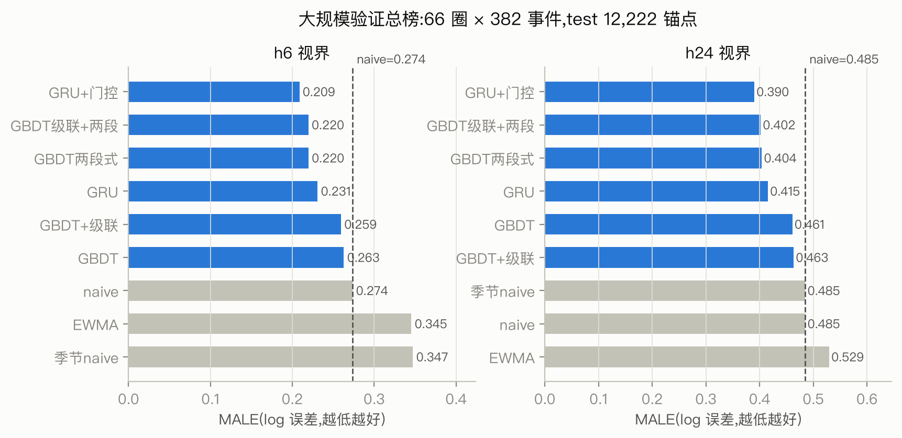
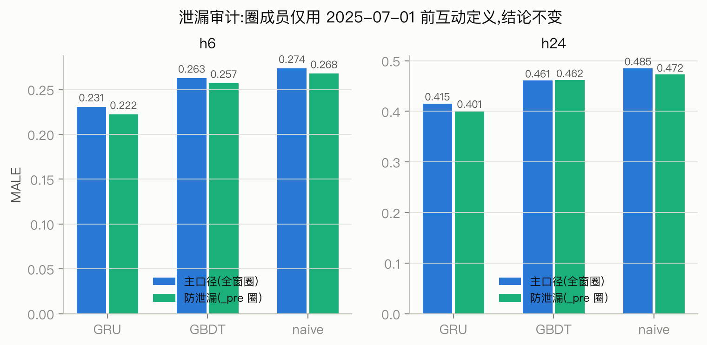
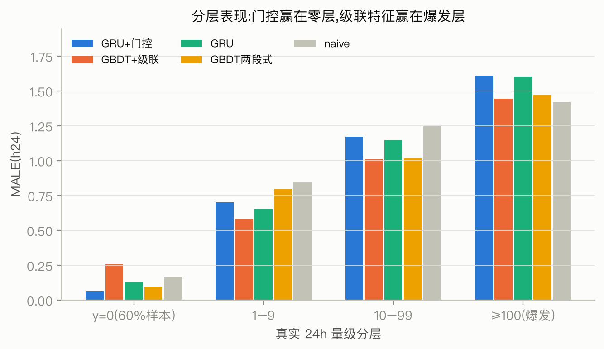
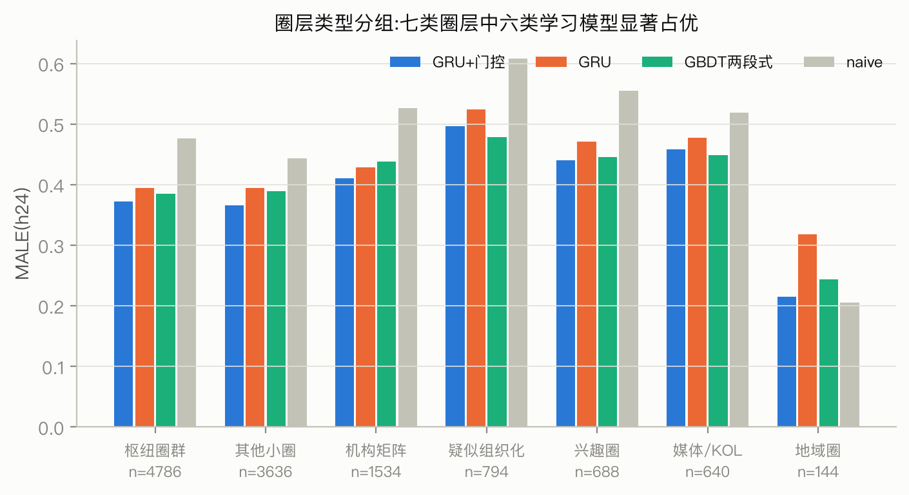

# 传播预测大规模验证:66 圈 × 382 事件(2026-08-04)

**目标**: 把筛选实验(32,圈 0/圈 5)选出的 GRU+GBDT 推到**全部 ≥100 人稳定圈**上验证,
完成防泄漏审计,并在大面板上做一轮结构化优化。
**代码**: `experiments/pred_full/`(服务器 `~/circleiq/pred_full/`)。
**结论先行**: ①筛选结论在 33 倍圈规模下完整复现——GRU 显著胜 naive,GBDT 边际缩水到不显著;
②防泄漏对照(圈成员仅用 2025-07-01 前互动定义)所有结论不变,泄漏疑虑排除;
③零膨胀是主要矛盾:**"分类门控 × 序列回归"分工(gru_gated)以 MALE 0.390 成为全场最优**,
对 naive 的边际比 GRU 单模型再扩大 37%;④爆发层(≥100)依然无人赢 naive,级联特征只带来
1-99 层的改进——**爆发不可预测是结构性结论**,进限制章节。

---

## 1. 面板:从 2 圈到 66 圈

| 项 | 筛选(32) | 大规模(本报告) |
|---|---|---|
| 圈 | {0, 5} | 全部 ≥100 人圈,**66 个**(83,892 人,84% 稳定用户) |
| 通道 | 6 固定 | C+4=70 通道存储,模型端组装六视图(目标圈/其余稳定/大V/机构/散户/总量) |
| 配对 | 471 | **2,334**(66/66 圈至少一对) |
| 锚点 | 20,592 | **100,072**(train 84,346 / val 3,504 / test 12,222) |
| 协议 | 事件 60/10/30 切分、6h 锚点步长、圈总帖 ≥100 门槛、MALE 主指标、按事件 bootstrap ×400 | 完全一致(切分函数逐字节相同,同一事件落同一折) |

y24 非零率 28.7%(筛选面板 33.1%)——扩圈引入更多小圈,零膨胀更重,这是后面所有优化的背景。

**与筛选实验的对照(c0/c5 子集)**:大规模面板上取圈 0/圈 5 的 test 锚点,
GRU h24 MALE 0.4192 vs 筛选实验 0.4191,naive 0.5095 vs 0.5095——逐锚点口径对齐,
两次实验可以直接比较。

## 2. 主结果

### 基础三模型(与筛选同配置)

| 模型 | h6 MALE | h24 MALE | h24 bootstrap vs naive(95% CI) |
|---|---|---|---|
| **GRU** | **0.231** | **0.415** | **−0.071 [−0.109, −0.033]** ✓ |
| GBDT | 0.263 | 0.461 | −0.025 [−0.060, +0.007](不显著) |
| naive | 0.274 | 0.485 | — |

筛选实验的排序完整复现(GRU>GBDT>naive),且两点变化值得注意:
- **GBDT 的 h24 边际从筛选面板的"接近显著"缩水到明确不显著**。原因在分层里:GBDT 的
  38 维特征在 y=0 层(60% 样本)系统性输给 naive(0.254 vs 0.167)——它没有机制把"预测
  恰好为零"表达出来,小圈占比升高后这个缺陷被放大
- GRU 的优势稳定:h6/h24 双视界、7 类圈层中 6 类、全部 4 个圈规模档都赢 naive

### 泄漏审计(P0-2 核心动作)

筛选实验的已知缺陷:圈成员身份由**全时间窗**互动定义,test 期的互动参与了圈的划分。
对照跑用 `partition_stable_K3_pre`(仅 2025-07-01 前互动,53 个 ≥100 人圈,49,891 人)
重建全部数据集+重训:

| 口径 | GRU h24 | naive h24 | GRU−naive |
|---|---|---|---|
| 主口径(全窗圈) | 0.415 | 0.485 | −0.071 [−0.109, −0.033] |
| 防泄漏(_pre 圈) | 0.401 | 0.472 | **−0.073 [−0.113, −0.042]** |

模型-基线边际在防泄漏口径下**没有缩小**(反而略增)。解释:圈成员身份影响的是"数谁的帖",
它对模型和 naive 是同一个目标定义,不构成模型侧的信息泄漏;真正可能的泄漏路径
(test 期互动让圈划分"预知"未来活跃)对预测任务的增益为零。**32 号报告的缺陷记录可以关闭**。

## 3. 优化轮:六条侧路,两条有效

从第一性原理看,大面板的误差由三块构成:零膨胀(60% 锚点 y=0)、量级回归、爆发相变。
六条侧路各攻一块:

| 侧路 | 假设 | h24 MALE | 判决 |
|---|---|---|---|
| **GBDT 两段式**(P(y>0) 分类 × 条件回归,val 选组合) | 零膨胀应显式建模 | **0.404** ✓ | **有效**:比 GBDT −0.057,变显著 |
| **gru_gated**(GBDT 分类门 × GRU 回归) | 门控和量级正交,各用最强 | **0.390** ✓ | **全场最优**:−0.097 [−0.131, −0.063] |
| GBDT+级联特征(近6/24h最大单根级联规模/份额) | 爆发由超级传播帖驱动 | 0.463(总),1-99 层 −0.03~−0.14 | 部分有效:中层改善,爆发层不动 |
| GRU 加权损失(权重 1+log1p(y)) | 高量级样本欠拟合 | 0.468 ✗ | 否决:牺牲零层换不来爆发层 |
| GBDT-Poisson 损失 | 计数分布先验 | 0.593 ✗ | 否决:重尾远超 Poisson,方差假设错 |
| 混合(筛选已验) | — | — | 已关闭 |

分层读法(h24):
- **y=0 层**:gru_gated 0.067,GRU 0.126,naive 0.167——门控把零层误差砍掉一半,
  这是它总榜第一的全部来源。代价是 AUC 从 0.92 降到 0.88(硬阈值丢掉连续信息),
  分歧样本预警场景仍应参考 GRU 原始输出
- **1–9 / 10–99 层**:GBDT 系(级联/两段式)最强,GRU 系居中,全部大幅赢 naive
- **≥100 爆发层**:naive 1.419 仍是第一,级联特征版 GBDT 1.447 最接近但没有翻盘。
  筛选报告的判断("爆发层要靠帖级建模换范式,不是加特征")在 3.3 倍的爆发样本
  (538 vs 163)上再次成立,**作为结构性限制写入论文**

### 圈层类型分组(回应赛题"不同圈层特性")

| 类型 | n | 最优模型 | MALE | vs naive |
|---|---|---|---|---|
| 枢纽圈群 | 4,786 | gru_gated | 0.373 | −22% |
| 其他小圈 | 3,636 | gbdt_2s | 0.389 | −12% |
| 机构矩阵 | 1,534 | gru_gated | 0.411 | −22% |
| 疑似组织化 | 794 | gbdt_casc_2s | 0.468 | −23% |
| 兴趣圈 | 688 | gbdt_casc_2s | 0.432 | −22% |
| 媒体/KOL | 640 | gbdt_casc_2s | 0.437 | −16% |
| 地域圈 | 144 | **naive** | 0.205 | — |

六类圈层学习模型全部显著占优,唯一例外是**地域圈**:样本最少(144)且活动最稀
(几乎总是 0),naive 报零就够了——不是模型失败,是这类圈在事件传播里本来就近乎沉默,
这本身是圈层特性的量化描述。

**疑似组织化圈是所有类型里最难预测的**(全模型 MALE 最高)。结合 34 号报告它同时是
"注入响应"最大的通道,这一对特征(难预测+易放大)正是把它列为监测对象的量化依据。

## 4. 判别面:圈层激活预测

同一预测器的 AUC(y>0 判别)零成本产出:GRU 0.917 / GBDT 0.912 / naive 0.864(h24)。
若下游只需要"哪些圈会被激活"而非量级,现有模型已经以 >0.91 的 AUC 可用,
且 gru_gated 的分类门本身就是校准过的激活概率。

## 5. 结论与选型更新

1. **主预测器:gru_gated(GBDT 分类门 × GRU 回归)**。总榜双视界第一,零层误差减半,
   结构是"每个子问题用最直接的工具"——分类器处理"发生与否",序列模型处理"多大"
2. GBDT 两段式作为可解释对照保留(特征重要性可读,MALE 仅差 0.014)
3. 爆发层不可预测写入 limitation,监测方案:gru_gated 门概率高+GRU/GBDT 残差分歧大的
   锚点人工复核(筛选报告的分歧样本建议在大面板上依然成立)
4. 泄漏审计关闭;所有后续实验直接用主口径 partition

## 附:产物清单

| 产物 | 位置 |
|---|---|
| 数据面板 | 服务器 `~/circleiq/pred_full/out/`(events/70通道+情绪张量, anchors, panel) |
| 防泄漏面板 | `~/circleiq/pred_full/out_pre/` |
| 12 模型预测 | `out/preds/*.parquet` |
| 结果 | `out/full_results.json`(仓库 `experiments/pred_full/results/` 有副本) |
| 代码 | `experiments/pred_full/{common,build_dataset,baselines,train_gbdt,train_gru,combine_gate,evaluate}.py` |
| 图 | `docs/figures/33-full_{male,strata,bytype,leakage}.png` |
