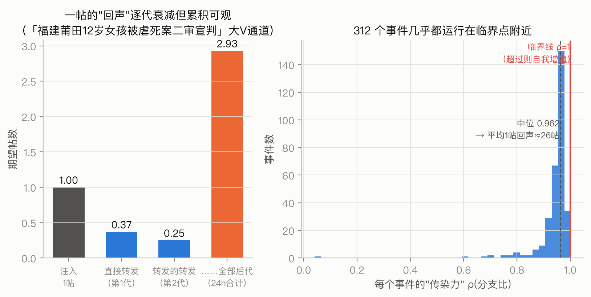
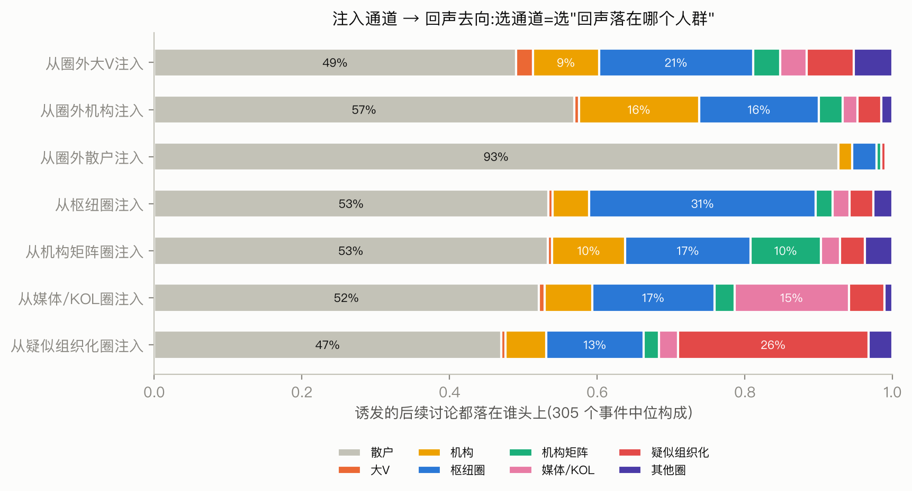
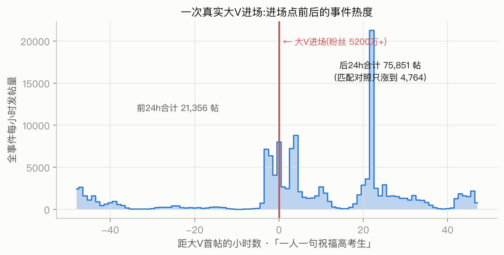

# 引导策略的效果测算与风险评估:从模拟到公式的重构及其解读

> 本文是 `34-strategy-closed-form-report.md`(技术版)的解读版,回答:策略层在算什么、
> 为什么把蒙特卡洛模拟换成数学公式、"打法表"每一行怎么读、"时机"的结论为何反转,
> 以及模型与真实世界对过的那一次账。

## 摘要

**目的**:回答赛题的核心问句——"如果在某个圈层投放内容,会发生什么?"具体拆成三问:
能带来多少新增讨论(效果)、新增讨论落在谁头上(溢出)、有多大概率把事态推向失控
(风险)。

**过程**:在此前拟合好的 312 个事件的传播模型(描述"谁的帖子引发谁转发"的激发网络)
之上,我们发现原先用蒙特卡洛模拟+网格搜索回答上述问题的做法,数学上可以被一个
**精确公式**替代——就像算贷款利息不必一遍遍数钱,复利公式直接给出答案。公式化之后,
原模拟结果中的两类假象(随机噪声、计算截断)被识别并剔除;省下的算力用于三件更有
价值的事:参数扰动下的稳健性检验、按圈层类型和内容情绪细分的"打法表"、以及用
1,067 次真实大 V 进场事件与模型对账。

**结论**:①效果与投放时机无关、与投放量成正比——这是传播模型线性性质的严格推论,
原先"低潮期投放收益更高"的结论被证明是计算假象;②**时机的真实作用在风险侧**:
低潮期投放最容易造成"可辨识的再点燃"(超额失控概率中位 8%,峰值期为 0);③各投放
渠道的本质差异不在"效果多少"而在"回声落在哪":散户渠道的回声 92% 留在散户层
(声量工具),圈层渠道的回声约半数外溢到散户、近四成流向其他圈层与权威层(渗透工具),大 V 渠道自身
几乎不留存(点火器);④行为最异常的"疑似组织化圈"投放响应是普通圈层的 4 倍,
叠加其最难预测的特性,定性为**只监测、不引导**的风险对象。

**结果**:公式与模拟在 17 组对照中全部一致(统计上无差异);通道排序在参数扰动下
保持稳定(相关系数中位 0.81);与现实对账:模型预判的方向与真实大 V 进场后的
超额增长方向一致(弱相关但统计可靠),量级低估两个数量级——模型只能代表
"平均的大 V 帖",代表不了顶流账号,这一边界如实写入。

**意义**:策略层从"跑模拟碰运气"升级为"解方程给答案+模拟只管风险尾部",每个数字
都可复算、可追溯误差来源;"效果查表、风险看时机、组织化圈只监测"构成了可以直接
落地的差异化引导策略框架。

---

## 1. 背景:效果测算的载体是一张"谁激发谁"的网络

策略层建立在阶段 C 拟合的传播模型上。对每个事件,模型把参与者分成至多 10 个通道
(至多 7 个规模够大的稳定圈层 + 圈外大 V、圈外机构号、圈外散户;视事件内圈层活跃度
实际为 3–10 个,中位 8 个),并从数据中估出一张
**激发表 A**:A[i→j] 表示"通道 i 的一条帖子,平均引发通道 j 多少条直接转发/跟发"。

这张表的读法就是传播的"传染病学":一条帖子引发第一代转发,第一代再引发第二代……
每一代按激发表衰减或放大。图 1 左展示了一个真实事件里大 V 通道的"回声"逐代累积
的过程:1 条帖子直接引发 0.37 条,第二代 0.25 条,24 小时内全部后代合计 2.93 条。

*图 1:左——"回声"的逐代分解(某案例事件,大 V 通道):单帖诱发量=各代之和。
右——312 个事件的"传染力"ρ 分布:ρ 是每条帖子平均引发的下一代帖数,ρ<1 时传播
终将熄灭,ρ>1 时自我增殖。九成事件集中在 0.9–1.0 之间(31 个事件低于 0.9,1 个略超临界)。*

图 1 右是全池 312 个事件"传染力"(分支比 ρ)的分布,它是理解本篇一切数字的钥匙:
**热点事件普遍运行在临界点(ρ=1)附近**。中位 ρ=0.962 意味着平均每帖的总回声约
1/(1−0.962)≈26 帖——离临界越近,同样的投放被放大得越厉害,但估算误差也被同比例
放大。这个"高杠杆、高误差敏感"的属性,决定了后文为什么要做扰动检验、为什么
只报中位数和区间。

## 2. 方法重构:为什么"算了几万次的模拟"可以换成一个公式

### 2.1 原方法的问题

原策略优化器的做法:对每个事件、每个候选策略(选哪个通道、投多少条、延迟多久),
把传播模型向前随机模拟几百次,取平均当作"预期效果",再在整个策略网格上搜索最优。
这个做法有三个内伤,都是我们在复审自己代码时坐实的:

1. **随机噪声被读成了规律**。几百次模拟的平均值仍有可观的波动,策略网格中
   "投 5 条比投 20 条划算"之类的细微差异,全部落在噪声幅度以内;
2. **计算截断制造假结论**。为防模拟失控,程序设有单次模拟 50 万事件的上限;
   临界附近的事件在高峰期模拟时频繁触顶,"有投放"和"无投放"两条轨迹被同一个
   天花板压平,差值算出来接近零——这就是原报告"高峰期投放没效果、低潮期效果
   巨大"结论的真实来源。**它是天花板的形状,不是传播的规律**;
3. **贵**。每个事件×策略组合要几百次模拟,全池扫描按天计。

### 2.2 替代方案:期望值有解析解

关键观察:这个传播模型是**线性**的——每条帖子的激发效果互相叠加、互不干扰。
线性系统的期望值不需要模拟:就像复利存款不需要逐日数钱、用公式直接算 30 年后的
余额一样,"投放 1 条帖子在 24 小时内的期望总回声"可以用矩阵运算精确解出
(数学上是一组线性微分方程的解,单事件毫秒级)。

公式化立刻带来四个红利:
- **无噪声**:同样的输入永远给同样的答案,策略间的比较不再受随机性污染;
- **无截断**:公式对临界以上的事件同样有限、良定义,天花板假象根除;
- **快几个数量级**:单事件从数百次模拟(分钟级)降到一次矩阵运算(毫秒级),
  全池 312 个事件从按天计降到 71 秒;省下的算力去做扰动检验和风险模拟;
- **副产品是结构**:公式同时给出回声在各通道的分布(下文"流向图"),这在模拟里
  要额外的记账才能得到。

### 2.3 验证:公式必须先向模拟证明自己

替换计算方法必须先证明两者算的是同一个东西。两层验证(图 2):
在人工构造的参数上,公式与独立实现的随机过程模拟误差 ≤2.1%;在 6 个真实事件
(传染力覆盖 ρ 0.84–0.99)× 每事件 2–3 个通道共 17 组上,公式值全部落在模拟的
统计涨落范围内。
**此后模拟只保留一个岗位:计算"失控概率"这类关于极端情况的量**(期望值有公式,
"最坏情况的概率"没有,见第 5 节)。

*图 2:公式(横轴)与蒙特卡洛模拟(纵轴)的对账,对角线=完全一致。17 组对照
(含 3 个近临界 ρ≥0.97 的事件)全部一致,误差棒为模拟自身的统计涨落。*

### 2.4 稳健性:结论在参数误差下能存活吗

激发表 A 是从数据估出来的,有误差;临界附近误差被放大 26 倍(中位)。我们把 A 的
每个元素随机上下扰动 20%(这不是估计误差的精确刻画,而是统一的压力测试幅度——
经近临界放大后它已足以让 Δ 数值波动数倍,是偏严的检验),重算全部结论,重复 50 次:**"哪个通道效果更好"的排序**
基本不动(排序相关系数 Kendall τ 中位 0.81),**具体数值**波动可达数倍。
因此本篇所有效果数字都以"305 个事件的中位数+四分位距"呈现,单事件的点值不进结论。
——这是"高杠杆系统里只有序数结论可靠"的一个诚实处理。

## 3. 打法表:效果、溢出与通道的真实角色

对每个事件、每个可投放通道,公式给出"投 1 条帖的 24h 期望回声"及其落点分布;
按圈层类型汇总(合并同类圈层、跨 305 个事件取中位数)后得到"打法表"(图 3)。

*图 3:各通道的效果(左,注意四分位距之宽——事件间差异远大于通道间差异)与溢出率
(右,回声中落在注入通道之外的比例)。红色=疑似组织化圈,单列讨论。*

**这张表最重要的读法转变:不要只看左边的"效果榜",要联合右边的"落点"读。**
图 4 把落点完全展开——每个通道注入后,诱发的讨论分别落在哪些人群:

*图 4:注入通道(行)→ 回声落点(色块)的中位构成。"选通道"本质上是在选
"你希望激起的讨论发生在谁中间"。*

三种截然不同的角色浮出水面:

- **散户通道 = 声量工具**:回声 92% 留在散户层内。想把话题"做大"但不求改变
  讨论结构,投散户;它几乎无法渗透进任何圈层——散户的转发很少激活稳定圈;
- **圈层通道 = 渗透工具**(圈层类型的画像见圈层识别篇:"枢纽圈"=跨省时政讨论的
  骨干圈群,"机构矩阵圈"=政务/媒体蓝V的互转网络):枢纽圈的回声约半数外溢到散户,
  31% 落回枢纽圈层——其中自身圈留存约 10%、其他枢纽圈约 21%;机构矩阵圈的回声
  还会带动 10% 的机构响应。想让特定人群(如政务系统、媒体人)接住并接力一个议题,
  必须从圈层内部注入——这是"圈层结构"对策略设计的最直接价值;
- **大 V 通道 = 点火器**:回声 98% 都在别人身上(散户 49%+枢纽圈 21%+机构 9%,
  其余约 19% 散落在媒体/KOL、机构矩阵等其他圈层类型),大 V 群体自身只吸收 2%。
  大 V 的作用是把能量传出去,而不是形成持续讨论的场所。

**内容情绪是第二个自由度**:按事件主导情绪分组重算(情绪为数据自带的逐帖标注;
事件主导情绪=非中性情绪中占比最高且超过 15% 的类别,否则记"中性主导"),愤怒/惊奇类事件中,权威通道
(机构、大 V)的效果翻倍(机构:20.1 vs 中性事件 8.6),圈层通道几乎不变。
直觉解释:高唤醒情绪放大的是"权威定调→大众转发"的级联,而圈内的互动惯性对情绪
不敏感。**策略含义:情绪激烈的事件里,权威下场的杠杆最大——但同一组数据也显示
其溢出率最高(0.88),即最容易把事件推向更大的公共场域,效果与扩散风险是同一
枚硬币的两面。**

**疑似组织化圈(红色)必须单独说**:它的投放响应(中位 51.9)是普通圈层的 4 倍。
这不是"最佳投放渠道",而是危险信号的另一面——4 倍响应来自其异常紧密的内部互转
结构,同一结构此前已经让它成为全场最难预测的圈层类型(见 33-2 解读篇)。
一个**高响应、低可预测、行为模式与自然用户不符**的群体,任何负责任的策略框架都
应把它标为**监测对象而非引导对象**:它是放大器,但你无法控制它放大什么。
这直接回应赛题"预测不同引导策略的潜在风险"。

## 4. "时机"的结论为何反转:一次自我纠错的完整记录

原报告曾有一个传播甚广的结论:"低潮期投放的效果远大于高峰期(时机>咖位)"。
公式化之后我们必须收回它的前半句,过程值得完整交代,因为它展示了结论的证据链:

1. 线性系统中,投放的**期望效果只取决于激发表,与投放时刻的系统状态严格无关**。
   桥接的直觉:模型假设帖子之间互不干扰,你投的每条帖引发的回声只由激发表决定,
   与当时场上已有多少帖无关——高峰期它照样激发那么多,只是被自然流量淹没得看不见。
   所以"时机影响期望效果"在这个模型里没有存身之处——这是数学推论,不是经验观察;
2. 那原先模拟里看到的"高峰期效果≈0"从哪来?——第 2.1 节的截断假象:高峰期
   两条模拟轨迹同时撞上 50 万上限,差值被人为压平;
3. 但"时机无关"只对**期望值**成立。风险(失控概率)是关于分布尾部的量,
   **强烈依赖时机**。

第 3 点用保留下来的模拟岗位量化(12 个代表性事件 × 低潮/上升/峰值三种投放时机,
共 34 组——2 个事件没有可用的上升期锚点。"失控"的口径:24 小时总量超过无投放时
300 次模拟的 95 分位的 1.5 倍,即明显越出自然波动的上界):低潮期投放使失控概率
中位增加 8 个百分点(最极端的两个事件分别达 100% 和 92%),上升期 3%,峰值期 0。

*图 5:同样的投放(大 V 通道 20 条),在事件不同相位注入的"超额失控概率"。*

峰值期投放为什么风险中位为零?因为峰值期的自然流量(本组中位约 700 条/小时,
大事件达数千条)淹没了 20 条的扰动;个别基线极小的事件在峰值注入仍有可观风险,
所以这是"中位为零",不是"绝对安全"。
低潮期投放为什么高风险?因为此时基线接近零,投放的回声是从无到有的再点燃,
必然"可辨识",且在近临界的传染力下可能滚成远超预期的规模(案例:某事件低潮期
基线预期 24h 仅 26 帖,投放后 95% 的模拟轨迹超过 1.5 倍上界,平均新增 2,430 帖)。

**修正后的时机结论:时机不改变你能"买到"多少讨论,但决定这次投放是隐入洪流
还是成为显眼的、可能失控的再点燃。低潮期是高杠杆窗口,同时是高风险窗口。**

## 5. 与现实对账:1,067 次真实大 V 进场

以上全部是模型内的推理。模型必须至少一次接受现实检验:**真实的大 V 中途加入
一个事件后,事件的实际增长与模型预判一致吗?**

设计上的最大敌人是"内生性":大 V 不是随机进场的,他们恰恰挑事件要火的时候进场,
简单的前后对比会把"事件本来要涨"错记在大 V 头上。我们的缓解办法是双重差分:
在同一事件里找一个"没有大 V 进场、但进场前 24 小时活动量相仿"的时刻作对照,
用"处理时刻的前后变化 − 对照时刻的前后变化"作为大 V 的净效应估计。305 个事件里
共找到 1,067 次进场,其中 911 次的对照匹配质量合格(进场前活动量与对照的差距足够小);
下文统计均基于合格子样本(图 6 是其中一次:5,200 万粉大 V 进场"祝福高考生"话题)。

*图 6:一次真实进场的原始数据。进场后 24h 事件总量 75,851 帖,而活动量相仿的
对照时刻只自然增长到 4,764 帖。*

对账结果(图 7)分两半:

- **方向对**:76.6% 的进场后出现正的净增长;模型预判值与实际净效应正相关
  (Spearman 0.12,p<0.001)。要按它的实际强度读:0.12 属弱相关,大样本下显著
  但解释力很小,它支持的只是"模型的排序方向大体不反"这一层判断,与 76.6% 的
  正向率互相呼应;
- **量级差两个数量级**:实际净效应中位约 1,500 帖,模型预判中位约 10 帖。

*图 7:911 次匹配合格进场的模型预判(横轴)vs 实际净效应(纵轴,对数刻度)。*

量级差距的三个来源,按我们认为的贡献排序:①**模型的"大 V 通道"是全体大 V 的
平均帖**,而自然实验里筛的是粉丝前 10% 的头部账号进场——顶流单帖的影响远超通道
平均,模型的通道分辨率到不了个体;②双重差分消不掉"大 V 预判事件将火才进场"的
预期性偏差,实际净效应本身是高估;③长尾事件里对照时刻系统性低估自然增长。

**如实的表述是:模型的方向判断获得现实支持,量级判断只在"平均通道帖"的口径下
成立,不能外推到具体头部账号。**这就是我们把"单帖大 V 神话的量化否定"降级为
限定表述的原因——模型没有资格对它测不到的东西下结论。

## 6. 结论:一个可交付的策略框架

把三部分拼起来,赛题要求的"差异化引导策略体系 + 效果评价 + 风险预测"落地为:

| 决策问题 | 回答工具 | 关键数字 |
|---|---|---|
| 投哪个通道 | 打法表(效果×落点) | 声量→散户(92%留存);渗透→圈层(约2成跨圈+权威响应);点火→大V |
| 投什么内容 | 情绪条件打法表 | 愤怒/惊奇事件权威通道效果×2,溢出也最高 |
| 何时投 | 风险-时机曲线 | 期望效果与时机无关;低潮投放失控概率+8pp |
| 投多少 | 线性缩放 | 效果∝投放量,无规模经济也无饱和(模型边界内) |
| 什么不能投 | 风险名单 | 疑似组织化圈:4倍响应+不可预测,只监测不引导 |
| 数字多可信 | 扰动检验+现实对账 | 排序可靠(τ=0.81),数值看区间;方向经 911 次合格现实对照弱支持 |

方法论上,本篇的过程本身是一个结论:**先把模型的数学性质榨干(哪些量有精确解),
再让昂贵的模拟只做数学做不了的事(尾部风险),最后强制与现实对一次账并如实报告
差距**——这个顺序保证了每个交付数字都知道自己的误差来自哪里。

## 附:术语速查

| 术语 | 本文含义 |
|---|---|
| 激发表 A | "通道 i 的一条帖平均引发通道 j 几条直接响应"的矩阵,从数据拟合 |
| 传染力 ρ(分支比) | 每条帖平均引发的下一代帖数;<1 熄灭,>1 自增殖,本池中位 0.962 |
| 闭式/公式解 | 不经随机模拟、由矩阵运算直接得到的精确期望值 |
| 蒙特卡洛(MC) | 按模型随机推演成百上千次取统计量;现仅用于失控概率 |
| 溢出 | 投放引发的讨论中,落在注入通道之外的比例 |
| 失控概率 | 24h 总量超过"无投放时 300 次模拟的 95 分位×1.5"的模拟概率 |
| 双重差分(DiD) | (进场前后变化)−(相仿对照时刻前后变化),消去事件自然趋势 |
| Kendall τ / Spearman | 两个排序/序列的一致程度,1=完全一致,0=无关 |
