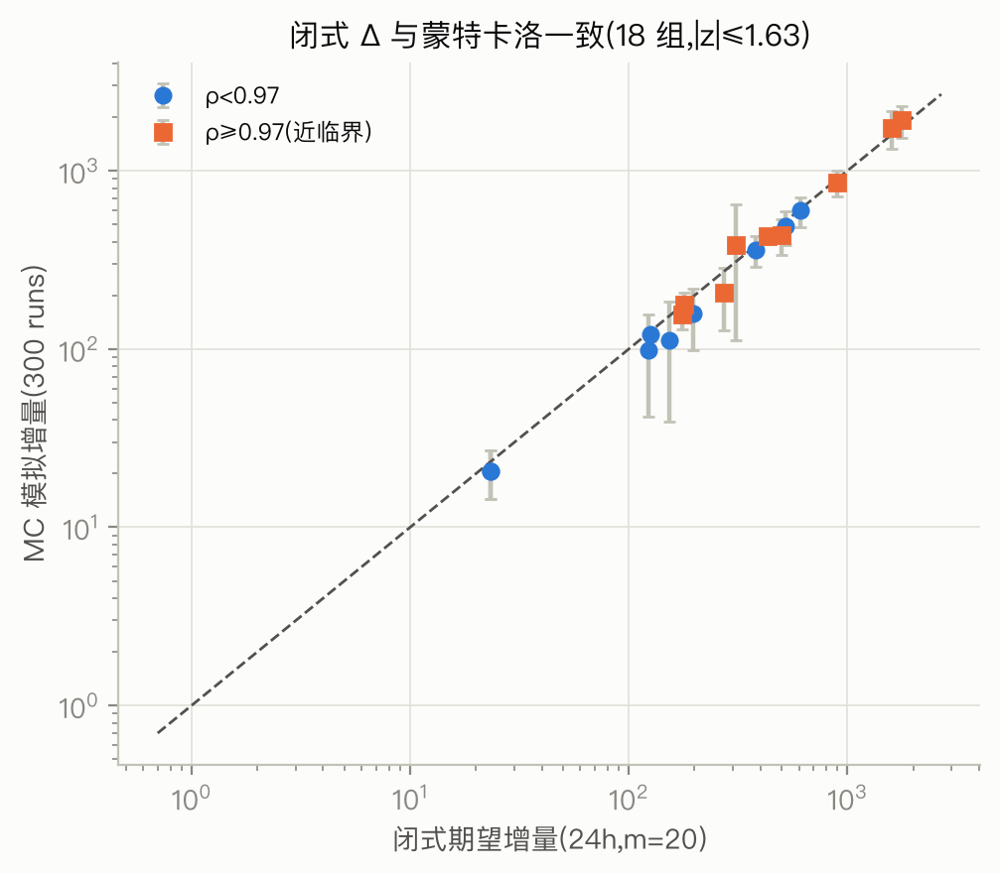
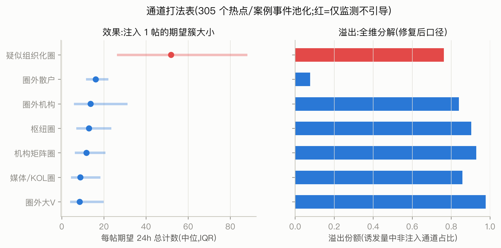
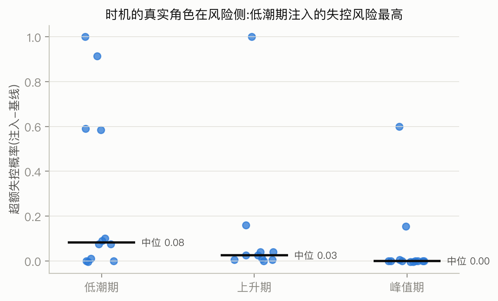
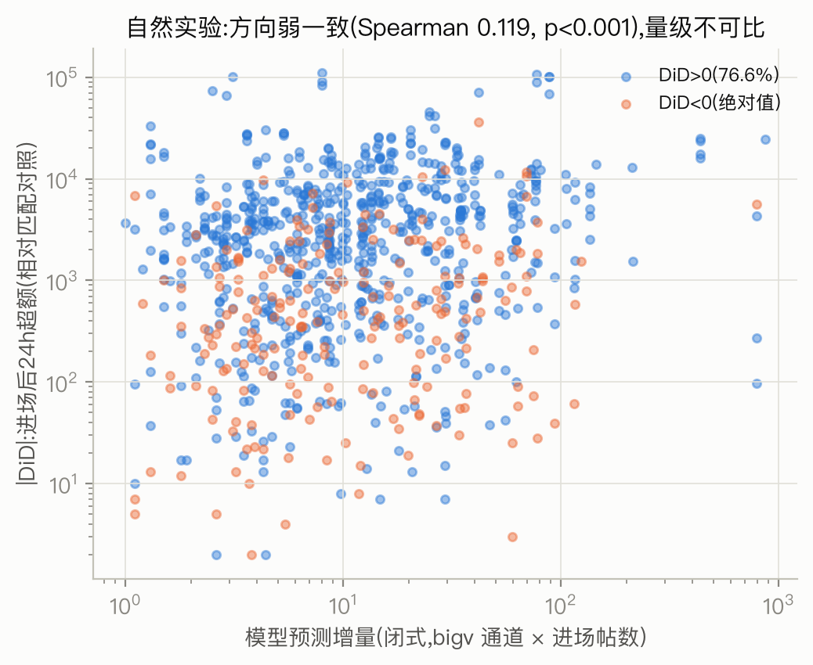

# 策略层重构:闭式反事实、打法表与风险时机(2026-08-04)

**目标**: 落实 P0-1/P0-3/P0-4——把策略评估从蒙特卡洛网格搜索重构为**闭式线性代数**,
在 312 个已拟合事件上建立"类型 × 通道 × 情绪"打法体系,并用自然实验触一次现实。
**代码**: `experiments/strategy_v2/`(服务器 `/root/data/{closed_form,strategy_system,natural_experiment}.py`)。
**结论先行**: ①双时间尺度 Hawkes 的 24h 期望增量有精确闭式(矩阵指数),与 MC 模拟
在 18 组对照上全部 |z|<2,**网格搜索退役**;②通道排序对 α ±20% 扰动的 Kendall τ 中位 0.81,
排序可用、数值要带区间读;③打法表最重要的数字不是"谁的 Δ 最大",而是**Δ 与溢出的联合分布**:
散户通道 Δ 中位 16.1 且 92% 留在散户层内(声量工具),圈通道 Δ 8-13、溢出 84-93%,
其中近四成进入其他稳定圈与权威层(结构渗透工具);④"时机>咖位"的余波落定:**效果侧时机无关(闭式推论),风险侧时机敏感
(低潮期注入超额失控概率中位 0.08,峰值期 0.00)**;⑤自然实验:1,067 次真实大V进场,
模型预测与 DiD 超额方向弱相关(Spearman 0.12,p<0.001)——方向可用,量级不可比,如实报告。

---

## 1. 数学重构:为什么可以不用蒙特卡洛

线性 Hawkes 的强度是历史的线性泛函,期望轨迹因此是常微分方程组的解。对双指数核
(快 β1 + 慢 β2),设 u1/u2 为两核衰减和的期望,注入维 d 一个事件后:

```
u1' = −β1·u1 + β1·(A1ᵀu1 + A2ᵀu2)     u1(0) = β1·e_d
u2' = −β2·u2 + β2·(A1ᵀu1 + A2ᵀu2)     u2(0) = β2·e_d
n(T) = e_d + ∫₀ᵀ (A1ᵀu1 + A2ᵀu2) dt
```

增广成 3K 维线性系统后 `expm(M·T)` 一次算出**全部 K 个注入通道**的 24h 期望计数向量
(单事件毫秒级,312 事件 71 秒含扰动)。两个极限自检:
- T→∞(亚临界):数值收敛到经典分支公式 `(I−Nᵀ)⁻¹e_d`(N=A1+A2),机器精度一致
- 对照独立实现的泊松分支过程 MC(3 万次):6h 视界最大相对误差 2.1%

对真实拟合参数的对照(`mc_validation.json`,6 事件 × 3 通道,覆盖 ρ 0.90→0.99):



18 组全部落在 MC 的 95% 置信带内(|z| ≤ 1.63)。与旧网格搜索的关键差异:**闭式对超临界
事件依然有限**(有限视界不发散),不存在 500k cap 截断——旧报告"爆发期 Δ≈0"的伪影
从计算层面根除。

有限视界的选择本身有信息:无穷视界 Δ 与 24h Δ 的比值中位 1.21、p99 2.73——多数事件
24h 已兑现大部分簇,但近临界事件的"长尾兑现"可达 2.7 倍,**报告 Δ 必须声明视界**。

### 敏感度:结论在 α 误差下能活多久

Δ = f(A) 且近临界有 1/(1−ρ) 放大(本池 ρ 中位 0.962,放大中位 26 倍)。A 元素独立
±20% 扰动 50 次:

- **通道排序** Kendall τ:中位 0.81,p10 0.60——"哪个通道更有效"的序稳定
- **数值**:同扰动下 Δ 波动可达数倍(放大效应),打法表只报中位+IQR,不报点值

## 2. 打法表(305 个热点/案例事件池化)



| 通道 | n | Δ24/帖(中位) | IQR | 溢出份额 | 散户占比 |
|---|---|---|---|---|---|
| 疑似组织化圈(圈2) | 84 | **51.9** | [26, 88] | 0.76 | 0.43 |
| 圈外散户 | 305 | 16.1 | [12, 22] | **0.08** | 0.92 |
| 圈外机构 | 305 | 13.7 | [6, 31] | 0.84 | 0.56 |
| 枢纽圈群 | 903 | 12.9 | [7, 24] | 0.90 | 0.54 |
| 机构矩阵圈 | 251 | 11.7 | [6, 21] | 0.93 | 0.52 |
| 媒体/KOL圈 | 88 | 8.8 | [4, 18] | 0.86 | 0.48 |
| 圈外大V | 305 | 8.5 | [4, 20] | **0.98** | 0.51 |

(溢出=诱发量中非注入通道占比,已修复旧 `delta_other_share` 只算散户维的口径;
成本不可比问题按 P0-3 处理:不做跨通道 ROI 排序,分通道报告。)

四条结构性读法:

1. **每个通道的角色由"Δ × 溢出去向"共同定义,不是单一榜单。**
   散户通道 Δ 不小但诱发量 92% 留在散户层——它是**广度/声量工具**;稳定圈通道的诱发量
   约半数流向散户、35-40% 进入其他稳定圈与权威层——它们是**结构渗透工具**
   (同时改变"谁在讨论"和"讨论多少")。圈外大V 溢出 98%:大V 通道自身不吸收任何后续,
   它是纯粹的**点火器**。
2. **疑似组织化圈(圈2)的 Δ 是全场 4 倍,这不是机会而是风险画像。**
   它由圈内高频互转(A 对角块大)驱动,叠加 33 号报告"该类型圈最难预测":
   高响应+低可预测的组合,量化坐实了"列为监测对象而非引导对象"(仅圈2 进入 Hawkes
   维度池;圈26 规模不足未进池,监测结论沿用 12 号报告的行为指纹)。
3. **情绪维度**:愤怒/惊奇主导的事件里权威通道的 Δ 翻倍(org 20.1/18.1 vs 中性 8.6,
   bigv 12.1/12.8 vs 6.7),圈通道基本不动(hub 13.7 vs 12.8)。高唤醒情绪放大的是
   **权威触发的级联**而不是圈内循环——"派权威下场"在情绪事件里效果最好,
   但同时溢出也最高(0.88),即最容易把事件推向大众场。
4. 与 31 号报告(网格搜索版)的结论对比:方向一致(圈注入渗透/散户广度),但旧版
   m×delay 网格的全部结构都被证实是 MC 噪声——线性性下 Δ 对 m 严格线性、对 delay
   严格无关。**策略的自由度只有"通道 × 内容(情绪)× 是否注入",时机不改变期望效果。**

## 3. 时机的真实角色:风险侧(P0-3 修正结论)

线性性砍掉了"时机影响收益",但**失控概率是尾部statistic,依赖注入时刻的系统状态**。
在 12 个代表性事件(按 ρ 分位覆盖)× 低潮/上升/峰值三相位注入 m=20(bigv 维),
MC 300 runs 测 P(24h 总量 > 1.5×基线 q95):



| 相位 | 超额失控概率(注入−基线,中位) | p75 |
|---|---|---|
| 低潮期 | **0.083** | 0.60 |
| 上升期 | 0.025 | 0.04 |
| 峰值期 | 0.000 | 0.006 |

低潮期的高失控读法要小心:此时基线 q95 本身很小,"失控"意味着**注入把一个安静的事件
重新点燃**(如 hot__20260317191839:基线中位 24h 仅 26 帖,注入后 95% 概率翻 1.5 倍以上,
Δ 中位 2,430)。这正是干预视角下有意义的风险定义——低潮注入的每一帖都是显著扰动;
峰值注入则被organic流量淹没。**修正后的策略结论:时机不改变期望收益,但决定
"这次注入是否会成为可辨识的、可能失控的扰动"——低潮期是高杠杆也是高风险窗口。**

## 4. 自然实验:模型第一次触现实(P0-4)

闭式 Δ 是模型内推论。唯一触及现实的检验:真实大V进场是否伴随模型预测的再加速。

**设计**(应对进场内生性):305 个热点/案例事件里,取粉丝 top10% 大V 在事件中的
**首帖时刻**(前后各留 24h),对照 = 同事件内无大V活动(±1h)的时刻按进场前 24h 活动量
最近邻匹配,DiD = 处理组前后差 − 对照组前后差;模型预测 = 闭式 bigv 通道 Δ × 进场帖数。
1,067 次进场,911 次匹配质量合格(log 活动量差 <0.3):



- **方向**:76.6% 的进场后超额为正;预测-DiD Spearman 0.119(p=3×10⁻⁴)——弱但显著
- **量级**:DiD 中位 1,549 vs 预测中位 9.5——**差两个数量级**,不可比

量级差距的三个来源,按诚实程度排列:①大V"选择进场"本身是事件即将升温的信号
(内生性残留,DiD 只能消掉水平项消不掉预期项);②模型的 bigv 通道是全体大V的平均帖,
顶级大V的单帖影响远超通道平均(32 号报告"咖位降级为 scoped 表述"的另一面);
③匹配对照在长尾事件里系统性低估反事实增长。**论文表述:模型对干预方向的预判与
现实一致,对量级的外推只在"通道平均帖"的口径下成立,不支持对具体头部账号的点预测。**

## 5. 验证体系总结(P0-4 重排后)

| 检验 | 结果 | 状态 |
|---|---|---|
| 闭式 vs 独立分支 MC(合成参数) | 6h 视界误差 ≤2.1% | ✓ |
| 闭式 vs Ogata thinning MC(真实参数 18 组) | 全部 \|z\|≤1.63 | ✓ |
| T→∞ 与分支公式代数一致 | 机器精度 | ✓ |
| α ±20% 扰动排序稳定性 | Kendall τ 中位 0.81 | ✓(数值带区间) |
| 跨事件池化稳定性 | 通道中位数跨 305 事件 IQR 有界 | ✓(31 号已验) |
| 自然实验(1,067 次真实进场) | 方向 Spearman 0.12*** / 量级不可比 | ⚠ 如实报告 |
| ~~placebo~~ | 闭式下恒等式 | 已砍 |

## 附:产物清单

| 产物 | 位置 |
|---|---|
| 闭式全量结果 | 服务器 `/root/data/strategy_v2/closed_form_all.json`(312 事件) |
| MC 对照 | `mc_validation.json`(18 组) |
| 打法表 | `playbook.json` + `playbook_rows.parquet` |
| 风险时机 | `risk_timing.json`(34 组) |
| 自然实验 | `natural_experiment.json`(1,067 行) |
| 仓库副本 | `experiments/strategy_v2/results/`(closed_form 为 slim 版) |
| 代码 | `experiments/strategy_v2/{closed_form,strategy_system,natural_experiment}.py` |
| 图 | `docs/figures/34-{closed_vs_mc,playbook,risk_timing,natexp}.png` |
