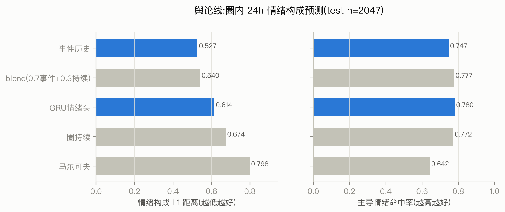
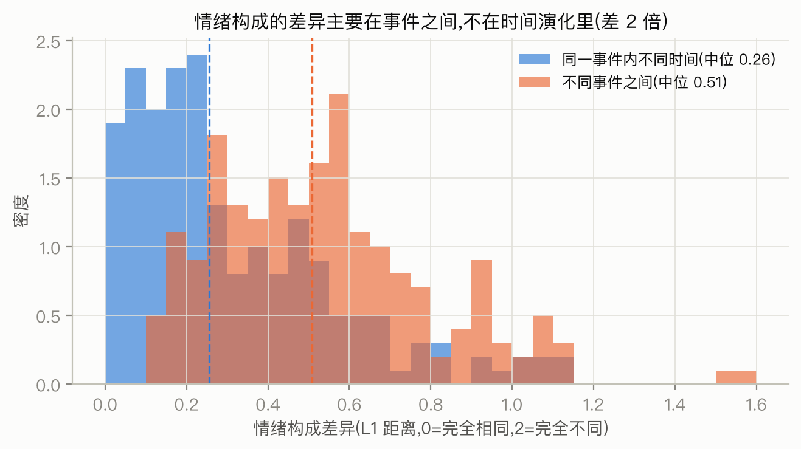

# 圈层舆论(情绪构成)的预测:方法、结果与解读

> 本文是 `35-sentiment-line-report.md`(技术版)的解读版,回答:为什么"舆论"要用
> 情绪构成来度量、五种预测方案的胜负说明了舆论的什么性质、以及"引导舆论"在数据上
> 的真实难度。

## 摘要

**目的**:赛题要求"量化预测策略对圈层**舆论**及用户行为的影响效果"。"用户行为"
(发帖量)已由预测篇覆盖;本篇补上"舆论"——我们用**圈层内讨论的情绪构成**
(中性/愤怒/惊奇/喜悦/悲伤/恐惧六类的占比)作为舆论的可计算代理,预测它在未来
24 小时的走向,并给出"投放某种情绪的内容能把圈层舆论推动多少"的定量接口。

**过程**:在与预测篇完全相同的考题框架上(考题按事件切成训练/调参/测试三份互不
重叠,任何参数选择只在调参集上做、从不接触测试集——防的就是"先看答案再选参数"),
让五种预测方案同场竞技:两个"什么都不学"的基线(圈层自身近期构成的延续、
事件整体的累计构成)、一个经典的舆论演化模型(马尔可夫状态转移)、一个神经网络
(GRU 情绪头)、以及基线的加权混合。胜负本身构成对"舆论如何运动"的检验。
另做方差分解与转发情绪继承分析,验证结论的机理。

**结论**:①舆论构成的信息**几乎全部在"这是个什么事件"里,很少在"圈层此刻的
情绪惯性"里**——"事件累计构成"这个零参数基线在构成误差上大幅击败圈层自身惯性,也胜过
神经网络;②经典的"情绪状态转移"式演化建模被数据否决——它甚至输给什么都不做,
因为情绪构成不存在有信息量的逐小时转移动力学;③最优方案是透明的两参数混合:
未来构成 ≈ 0.7×事件累计构成 + 0.3×圈层近期构成——"事件定调七成,圈层个性三成";
④由此推出舆论引导的定量边界:在十万帖量级的热点里,单次投放对圈层情绪构成的
期望推移不足 1%,**可测的舆论改变只能来自小事件早期或持续的组织化投放**。

**结果**:混合方案的构成误差(L1 距离,取值 0–2,0=构成完全相同)0.540,比圈层
惯性基线(0.674)改善 20%;主导情绪命中率 0.777(此指标各方案都在 0.75–0.78 附近,
区分度低,见正文);全部结论经按事件重抽样检验可靠。

**意义**:舆论线不仅补齐了赛题拼图,还给出了两个超出预期的判断——舆论的
"事件主导"性质意味着**内容选择(投什么事件、什么情绪)远比投放节奏重要**;
而 1% 的单点推移上界与组织化累积的可能性,恰好从正面论证了为什么疑似组织化圈层
值得作为风险对象持续监测。

---

## 1. 问题定义:用什么度量"舆论",以及为什么

"舆论"要进入定量预测,必须先选一个可计算的代理。我们选择**情绪构成**:某圈层
在某事件中,讨论帖的六类情绪(中性/愤怒/惊奇/喜悦/悲伤/恐惧)占比向量。理由:

1. **数据支持最好**:情绪标注在热点/案例数据中的填充率接近 100%,是所有"舆论"
   候选度量中唯一有全量数据的;
2. **与决策相关**:管理者关心的"舆论恶化"在数据上最直接的表现就是愤怒占比上升;
3. **诚实的边界**:情绪≠立场。数据没有"支持/反对"的标注,立场维度我们明确
   放弃并写入舍弃清单,不做无字段支撑的推断。

预测目标:给定锚点(考题时刻)之前的全部历史,预测目标圈层在未来 24 小时内
发帖的情绪构成。只考未来 24h 至少 5 帖的考题(12,886 道)——不足 5 帖时"构成"
在统计上没有意义。评分用 L1 距离(两个构成向量各分量差的绝对值之和,0=完全相同,
2=完全不同)和主导情绪命中率。

一个必须先排除的疑点:**情绪标注会不会只是转发时自动复制原帖的标签?**若是,
"预测构成"就退化为"预测转发结构"。检验:转发帖与其根帖的情绪一致率仅 76.6%
(愤怒帖被继承得最多,87.6%;恐惧最少,48.8%)。近四分之一(23.4%)的转发者表达了与原帖
不同的情绪——情绪列包含真实的个体变异,预测任务成立。

## 2. 五个候选方案:每一个都是关于"舆论如何运动"的假设

方法对比的意义超出选型——**每个方案代表一种舆论运动观,胜负即检验**:

| 方案 | 背后的舆论观 |
|---|---|
| 圈持续(惯性) | "圈层有自己的情绪状态,短期内延续" |
| 事件构成 | "舆论由事件本身决定,圈层只是事件的采样" |
| 马尔可夫转移 | "情绪像状态机一样按固定概率互相转化"(经典舆论动力学的离散版) |
| GRU 情绪头(GRU 是一种逐小时"阅读"历史曲线的神经网络;"情绪头"指其末端直接输出六类情绪占比的部件) | "存在复杂的时序模式,让神经网络自己找" |
| 混合(事件+惯性) | "事件定调,圈层个性修边" |

## 3. 结果:事件定调七成,圈层个性三成

| 方案 | 构成误差 L1↓ | 主导情绪命中↑ | 与惯性基线相比 |
|---|---|---|---|
| **混合(0.7事件+0.3惯性)** | **0.540** | **0.777** | 改善 20%,可靠 |
| 事件构成 | 0.527 | 0.747 | 改善 22%,可靠 |
| GRU 情绪头 | 0.614 | 0.780 | 改善 9%,可靠 |
| 圈持续(惯性) | 0.674 | 0.772 | — |
| 马尔可夫转移 | 0.798 | 0.642 | **恶化 19%** |

(混合的 L1 略高于纯事件构成,但主导命中率高 3 个百分点、综合最均衡,被选定;
0.7/0.3 的权重不是拍脑袋,是在调参集上扫描选出的最优值,评分用的测试集从未参与
这个选择。)

*图 1:五方案在测试集上的构成误差(左)与主导情绪命中率(右)。*

关于主导情绪命中率要先说明一点:除马尔可夫外,各方案都挤在 0.75–0.78 之间——
因为多数考题的主导情绪就是"中性",谁都容易猜中,该指标天花板效应明显、区分度低。
主要裁决指标是 L1;GRU 的命中率(0.780)与混合(0.777)的差距在重抽样噪声以内,
弃 GRU 选混合的理由是 L1 落后 0.07 与可解释性,不是命中率。

三场"胜负"各说明一件事:

**胜负一:事件构成大胜圈层惯性(0.527 vs 0.674)。** 为什么?我们做了直接的
方差分解(图 2):随机抽取事件内不同时段的 24h 窗口,窗口构成与全事件构成的
典型差异(L1 中位 0.26)只有**不同事件之间**构成差异(0.51)的一半。翻译成
普通话:**知道"这是哪个事件",你就知道了情绪构成的大头;知道"现在是事件的第几天",
几乎不增加信息**。世乒赛的讨论从头到尾以喜悦为主,虐童案从头到尾以愤怒为主,
这两个事件之间的差异,远大于任何一个事件内部随时间的漂移。

*图 2:情绪构成差异的两个来源。蓝=同一事件内不同时间窗之间;橙=不同事件之间。
橙色分布整体在蓝色右侧一倍处——舆论构成的方差主要由"事件是什么"贡献。*

**胜负二:马尔可夫模型输给"什么都不做"(0.798 vs 0.674)。** 这是本篇最有
方法论价值的否决。马尔可夫模型假设情绪按固定概率逐小时转移(愤怒→中性 x%,
中性→惊奇 y%……),把这张转移表连乘 24 步来预测。失败的机理很清楚:逐小时转移
的长期连乘会收敛到一个"全局平均构成",把"这个事件本来是愤怒事件"的信息抹掉了。
它失败恰恰因为**情绪构成没有值得建模的逐小时转移动力学**——这正是胜负一的另一面。
经典舆论演化模型(意见动力学、状态转移)在这份数据上的适用性因此被打上问号:
它们建模的对象(个体意见的相互转化)可能真实存在,但在圈层×事件的聚合尺度上,
构成的主导因素是事件锚定而非转移过程。

**胜负三:神经网络没有跑赢零参数基线(0.614 vs 0.527)。** GRU 能从 168 小时的
历史里学到平滑和参照,显著好于惯性,但它看不到 168 小时窗口之外的"事件长期构成"
——而那才是最强的信号。这与预测篇"机制模型输给持续性"的教训同构:**当最强信号
是一个简单统计量时,复杂模型的容量花在了错的地方**。把"事件累计构成"也作为输入
信息提供给 GRU,大概率能追平混合方案,但一个透明的两参数公式已经够用——我们选择了可解释性。

## 4. 从预测到引导:舆论能被"推动"多少

舆论线的最终目的不是预测本身,而是给策略层一个**投放→舆论变化**的换算接口。
把两条已验证的结果拼起来:

1. **构成公式**(本篇):圈层未来构成 ≈ 0.7×事件构成 + 0.3×圈层惯性。投放改变
   舆论的路径是改变"事件构成"这一项;
2. **回声公式**(策略篇):投放 m 条情绪 s 的帖子,期望带来约 m×Δ 条后续讨论
   (Δ 是回声系数——每投 1 帖平均诱发的后续帖数,随投放者身份不同而不同,策略篇
   称之为"通道";普通圈层与权威通道的典型值 8–16),其中约 77% 继承投放情绪
   (按转发情绪一致率折算)。

合起来:投放对事件情绪构成的推移量 ≈ m×(1+0.77Δ)/N,N 为事件总帖量。代入典型
数字立刻得到一个清醒的结论:**在 N≈10 万的热点里,一次 20 帖的投放即使回声全部
兑现(Δ 取 8–16,总触达约 140–270 帖),事件构成的推移也只有 0.1%–0.3%,再经
0.7 的构成折算后对圈层舆论的影响不足 0.2%——远低于测量噪声**。可测的舆论改变
只存在于两种场景:

- **小事件/事件极早期**(N 还小,分母小),这与策略篇"低潮期高杠杆、高风险"
  的结论在时间轴上是同一个窗口;
- **持续、成规模的投放**(m 累积变大)——这正是组织化传播的操作模式。

第二点值得停一拍:我们从"舆论多难被推动"的正面测算,反推出了**什么样的行为者
才有能力推动舆论——只有组织化的持续投放**。这为圈层识别篇发现的疑似组织化圈层
(内容高度同质、情绪清一色中性、高产互转)提供了第三块拼图:它们的行为模式,
恰好是唯一能通过累积效应改变舆论构成的模式。识别(它们长什么样)、预测
(它们不可预测)、策略(它们响应异常)、舆论(只有它们能累积推动)四条证据链
在此闭合,"组织化传播是首要风险对象"从直觉变成了可辩护的定量判断。

## 5. 边界与诚实声明

- **情绪≠立场**:六类情绪捕捉不到"支持谁"。若未来有立场标注,本篇框架
  (构成预测+混合基线)可直接复用;
- **活跃偏置**:只考"未来 24h ≥5 帖"的考题,结论适用于活跃的圈层×事件组合;
  沉默圈层的"舆论"在数据上不存在,也就无从预测;
- **77% 继承率是全局一致率(汇总比例)**,愤怒内容的继承率更高(87.6%),意味着投放愤怒内容
  的舆论推移效率高于其他情绪——这同时是效果参数和伦理风险参数,我们把它作为
  风险侧材料呈报而不作为策略建议。

## 6. 结论

1. 圈层舆论(情绪构成)可预测,最优方案是**透明的两参数混合**:事件定调七成、
   圈层个性三成;误差比惯性基线低 20%,主导情绪命中 78%;
2. "舆论演化"的经典建模(状态转移)在此数据上被否决:构成的方差在事件之间,
   不在时间转移里——**选对事件粒度的锚,比建模时间动力学重要**;
3. 舆论引导的定量边界:热点中的单点投放推不动构成(<1%);可测的推动只属于
   小事件早期或组织化累积——前者是策略窗口,后者是风险监测的对象;
4. 方法论:让每个候选模型代表一种关于对象如何运动的假设,用同一套考题裁决,
   胜负本身就是关于"舆论是什么"的实证发现。

## 附:术语速查

| 术语 | 本文含义 |
|---|---|
| 情绪构成 | 六类情绪帖数占比向量,本文中"舆论"的可计算代理 |
| L1 距离 | 两个构成向量的分量差绝对值之和;0=相同,2=完全不同 |
| 主导情绪命中率 | 预测的第一大情绪与真实第一大情绪一致的比例 |
| 马尔可夫转移 | "情绪按固定概率逐小时互相转化"的经典演化模型 |
| 事件构成基线 | 用锚点前全事件(所有人)的累计情绪构成直接作为预测 |
| 方差分解 | 把构成差异拆成"事件之间"与"事件内时间之间"两个来源比大小 |
| 继承率 | 转发帖与根帖情绪一致的比例(全局 76.6%) |
