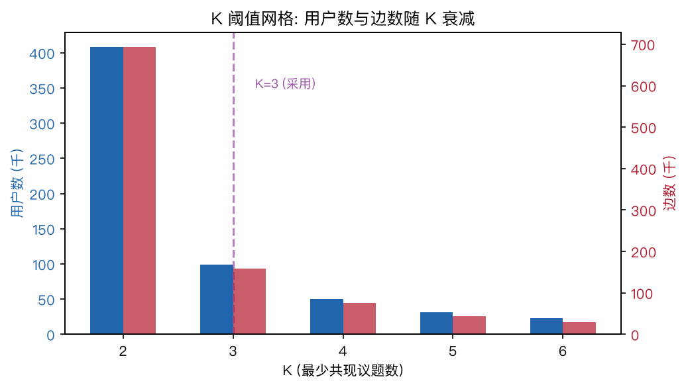
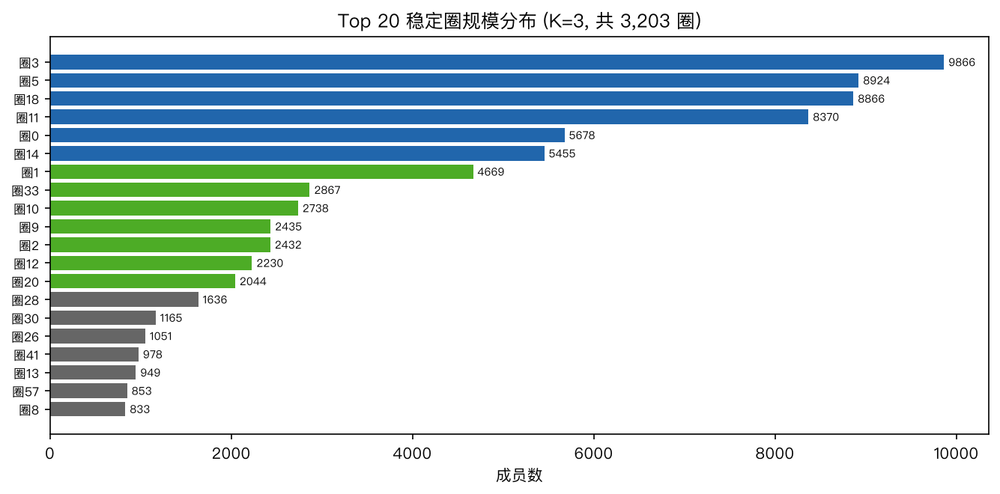
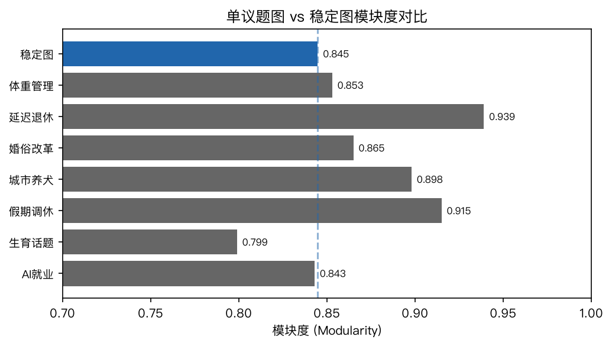
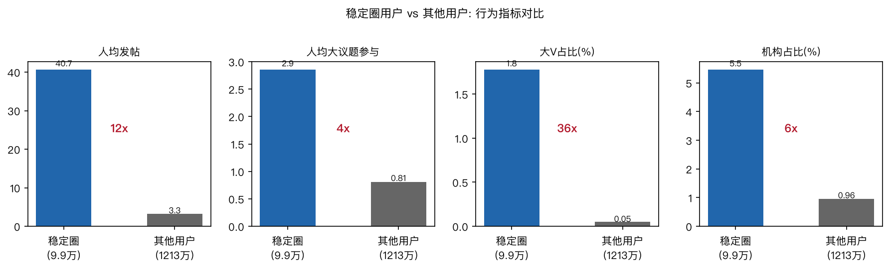
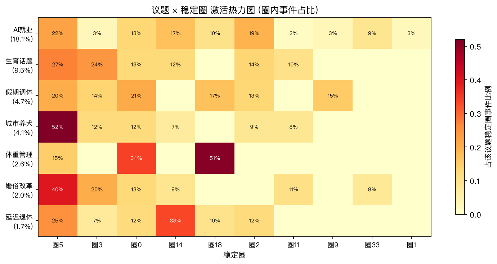

# 阶段A报告:跨议题稳定互动圈识别(全量)

**日期**: 2026-07-27 · **GPU终版口径** · **数据**: 382 个数据单元(7 重大议题 + 263 热点事件 + 112 传播案例,4385 万帖,去重复 zip 后)
**代码**: `pipeline/server/{build_edges,stable_circles,leiden_per_topic,eval_stable,user_profiles}.py` · **产物**: ppio-gpu `~/data/` + 仓库 `results/`
**面向读者友好版**: 见 [circle-identification-results.md](circle-identification-results.md)

---

## 1. 问题与方法

单议题互动图上的社区是**事件观测**而非**社交结构**(方法论转向的完整论证见 [persistent-community-framework.md](persistent-community-framework.md))。本阶段在全量数据上落地"跨议题稳定互动圈":

1. 每个数据单元独立构建转发互动边表(共 382 单元 → **1092 万条互动事件,906 万条聚合边**)
2. 对每对用户统计共同出现互动的单元数 `n_topics(u,v)`
3. 过滤 `n_topics ≥ K` 得稳定图,其上跑 Leiden(3 种子取最优)

与原计划的差异(依据与全部修正见 [plan-revision-2026-07-27.md](plan-revision-2026-07-27.md)):n_topics 跨全部 382 个单元统计(不只 7 个重大议题)——263 个热点事件把"同一对用户反复互动"的观测机会放大一个数量级。

## 2. 边表构建(全量实测)

| 议题 | 帖数(去重后) | 聚合边数 | 方法 |
|---|---|---|---|
| 生育话题 | 9,995,844 | 2,721,071 | parent_mid |
| AI就业 | 2,247,196 | 1,493,378 | parent_mid |
| 假期调休 | 2,200,777 | 285,454 | parent_mid |
| 婚俗改革 | 2,000,222 | 171,867 | parent_mid |
| 城市养犬 | 1,669,726 | 143,761 | parent_mid |
| 延迟退休 | 2,626,936 | 108,346 | parent_mid |
| 体重管理 | 1,133,918 | 78,288 | root_name(无MD5列,作者名回连) |

MD5 双空值哨兵已在预处理置 null,伪边天然被排除(见 [data-processing.md](data-processing.md) §3.1)。382 个单元的边表构建在 24 核服务器仅 **9 秒**(polars 多核)。

## 3. K 阈值选择

| K | 稳定边 | 稳定用户 | 说明 |
|---|---|---|---|
| 2 | 693,831 | 408,622 | 覆盖最广,仍含偶发同现 |
| **3** | **159,298** | **99,337** | **采用**:覆盖与稳定性的折中 |
| 4 | 74,909 | 50,101 | 更严,可作稳健性检验 |
| 6 | 28,994 | 22,515 | 深度稳定核心 |

K=3 含义:在**至少 3 个不同议题/事件**中都与他人产生转发互动。

**鲁棒性注**: 两次数据修正(生育话题补 719 万行 + 去除重复 zip)带来的稳定用户数扰动分别为 +14 和 -11,总幅度 ±0.01%,模块度不变——稳定圈结构对数据增量高度鲁棒,佐证其反映的是真实跨议题组织而非采样噪声。

## 4. 稳定圈结构

- **99,337 稳定用户 → 3,203 个稳定圈**,其中 ≥10 人的 378 个,≥100 人 66 个,≥1000 人 16 个,top 圈 9,866 人
- **模块度 0.8448**,3 种子 ARI 0.91/0.93(结构稳定,非算法伪影)
- 防泄漏版(仅用 2025-07-01 前互动):62,969 用户,2,367 圈,模块度 0.884——供传播预测层严格防泄漏使用

单议题图模块度 0.80-0.94(全量,高于 POC 3-csv 时的 0.75-0.89),稳定图 0.845 与之同级——**稳定图在过滤 94% 偶发边后仍保持同等强度的社区结构**,说明留下的是真实社交组织。

## 5. 稳定圈是什么人?

| 指标 | 稳定圈用户(9.9万) | 其他用户(1213万) | 倍数 |
|---|---|---|---|
| 人均发帖 | 40.7 | 3.3 | 12.3× |
| 人均参与大议题数 | 2.86 | 0.81 | 3.5× |
| 大V占比 | 1.78% | 0.05% | 36× |
| 机构占比 | 5.47% | 0.96% | 5.7× |
| log(粉丝+1)均值 | 5.45 | 3.07 | - |

稳定圈是**跨议题活跃的传播骨干**(媒体、大V、深度参与者),但 92.8% 的成员是普通/认证用户——不是"大V俱乐部",而是围绕传播节点组织起来的活跃社群。

**画像多样性**: top 圈省份熵 ≈ 2.94–3.16(基线 3.11),即稳定圈**跨地域**组织——与单议题 POC 的结论一致(圈层≠地域切分,ARI 0.04)。

## 6. 议题如何激活稳定圈

- **AI就业**: 稳定圈成员贡献 18.1% 事件,且广泛激活几乎所有 top 圈——科技类议题是稳定骨干的"主场"
- **生育话题**(9.5%,全量口径): 集中激活圈5/圈3/圈2等
- **延迟退休**(1.65%)/婚俗改革(2.0%): 几乎不动员稳定圈——此类民生议题传播主要靠散户
- 策略含义:**同一策略在不同议题下可触达的稳定圈完全不同**,引导前要先看该议题的激活谱

## 7. 与单议题圈的关系(ARI)

稳定圈 vs 各单议题 Leiden 圈在公共用户上的 ARI = **0.32-0.50**:相关但显著不同。稳定圈捕捉的是单议题视角看不到的跨议题组织——这正是它作为"策略持续作用对象"的独立价值。

## 8. 内容一致性(BGE embedding,91,309 稳定用户)

方法与单议题实验相同(BGE-small-zh-v1.5 编码用户聚合文本,圈内随机 pair 平均余弦 vs 全体随机 pair 基线;4090 编码 26.6 秒):

| 口径 | 稳定圈 | 单议题 Leiden 圈(前实验) |
|---|---|---|
| 随机基线 | 0.498 | 0.491 |
| 圈内加权平均 | **0.586**(+17.7%) | 0.583(+18.7%) |
| 圈内未加权平均 | **0.654**(+31%) | 0.64(+30%) |

**结论(诚实版)**: "稳定圈内容一致性显著高于单议题圈"的假设**未获支持**——两者几乎持平。但这个"持平"本身有价值:稳定圈是**跨话题**定义的(成员在 ≥3 个不同议题互动),却保持了与话题内圈层同等的内容凝聚度,说明跨议题稳定互动伴随稳定的兴趣/表达趋同,而非话题的偶然共现。

## 9. 结论与遗留

**结论**:
1. 跨议题稳定互动圈在全量数据上可识别、结构强(模块度 0.8448)、种子稳定(ARI≥0.91)
2. 稳定圈=跨议题传播骨干,画像上跨地域跨行业,行为上高活跃高认证率
3. 议题激活谱差异巨大(1.65%-18.1%),是策略设计的关键输入

**遗留/下一步**:
- ~~生育话题 2 个 zip 修复后增量重跑~~ **已完成**——数字变化可忽略(±0.01%),已按GPU终版口径更新本报告
- ~~内容一致性评估(BGE)在稳定圈上重算~~ **已完成**(见 §8)
- 稳定圈作为 Hawkes 维度进入传播预测层(阶段C,全量拟合已完成)
- **圈层识别结果的完整解读报告**: [circle-identification-results.md](circle-identification-results.md)
